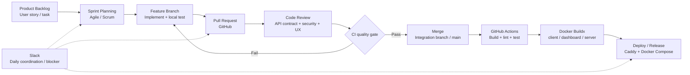
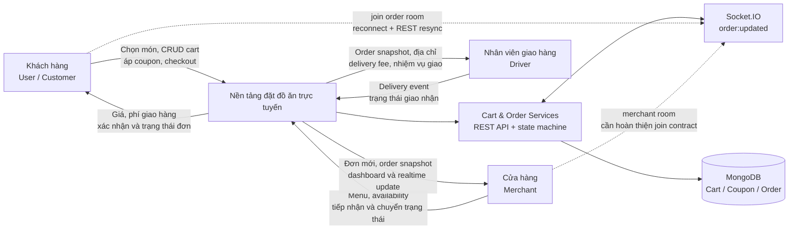

# CHƯƠNG 1: GIỚI THIỆU CHUNG

## 1.1. Giới thiệu đơn vị thực tập

FPT Software cung cấp dịch vụ phát triển phần mềm, tư vấn chuyển đổi số và vận hành hệ thống cho khách hàng trong nước và quốc tế. Trong môi trường dự án định hướng Nhật Bản, các yêu cầu về tính kỷ luật, khả năng phối hợp đa vai trò, chất lượng sản phẩm và khả năng truy vết thay đổi được đặt ở vị trí quan trọng trong vòng đời phát triển phần mềm.

Chương trình Campuslink Front-End tạo điều kiện để sinh viên tiếp cận quy trình dự án doanh nghiệp thông qua việc phân tích yêu cầu, triển khai chức năng, phối hợp nhóm và kiểm soát mã nguồn.

Quy trình phát triển được tổ chức theo mô hình **Agile/Scrum**. Công việc được phân rã thành các user story hoặc task trong Sprint, sau đó được hiện thực trên feature branch theo định hướng Git Flow. GitHub được sử dụng để lưu trữ repository, quản lý branch, mở Pull Request, thực hiện Code Review và theo dõi lịch sử thay đổi. Slack hỗ trợ trao đổi nhanh, làm rõ `API contract`, thông báo blocker và phối hợp giữa các vai trò; các quyết định kỹ thuật quan trọng cần được phản ánh lại trong issue, Pull Request hoặc tài liệu để bảo đảm khả năng truy vết.

Ở cấp CI/CD, workflow GitHub Actions của repository thực hiện `npm ci`, build toàn bộ workspace, lint và test dashboard trước khi publish các image Docker của customer, dashboard và server. Cách tổ chức này tạo quality gate trước khi thay đổi được đưa vào nhánh tích hợp hoặc phát hành. Quy trình phát triển và kiểm soát mã nguồn của dự án được minh họa tại **Hình 1.1**.

<strong><em>Hình 1.1: Quy trình phát triển và kiểm soát mã nguồn dự án</em></strong>

## 1.2. Giới thiệu công việc và vai trò đảm nhiệm

Trong chương trình thực tập, em đảm nhiệm vị trí **Fullstack Web Developer Intern**, tham gia cả backend và frontend. Phạm vi trách nhiệm tập trung vào phân hệ **Cart & Order Processing**, là điểm nối giữa thao tác chọn món của customer, dữ liệu nhà hàng, thanh toán, cập nhật trạng thái và khả năng mở rộng sang điều phối giao hàng.

Đây là phạm vi có tính liên kết cao. Một thay đổi ở giá món, phí giao hàng, coupon hoặc enum trạng thái có thể ảnh hưởng đồng thời đến giao diện, `API contract`, dữ liệu MongoDB, dashboard merchant và các sự kiện realtime. Vì vậy, công việc không chỉ là viết endpoint mà còn phải bảo đảm tính nhất quán của toàn bộ chuỗi `Cart → Checkout → Order → Status Synchronization`.

Trách nhiệm kỹ thuật đầu tiên là nghiên cứu giải pháp, bao gồm phân tích yêu cầu nghiệp vụ, xác định state machine của đơn hàng, lựa chọn RESTful API cho thao tác đồng bộ và Socket.IO cho `Real-time Communication`. Trên cơ sở đó, em thiết kế các thực thể `Cart`, `Coupon` và `Order`, xác định quan hệ với `User`, `Restaurant` và `MenuItem`, đồng thời bảo đảm `Order` lưu snapshot khách hàng, nhà hàng, item và pricing tại thời điểm checkout.

Ở phía backend, em xây dựng route, controller, service và repository cho CRUD giỏ hàng, áp coupon, tính phí giao hàng, checkout tại `POST /api/orders/checkout`, lịch sử đơn, reorder, hủy đơn và chuyển trạng thái phía owner. Ở phía frontend, em thiết kế và cài đặt `CartContext`, `CartPage`, `CheckoutPage`, `OrderHistoryPage` và `OrderDetailPage`, kết nối API service, xử lý optimistic update và thực hiện resynchronization dữ liệu khi cần.

Đối với chức năng realtime, em cấu hình Socket.IO client/server, xác thực JWT trong handshake, join room `order:{orderId}`, phát event `order:updated` sau khi `Order.save()` hoàn tất và gọi REST để resynchronization khi reconnect. Trong quá trình tích hợp, em duy trì `API contract` với Auth, Merchant, Payment, Review và interface Driver, đồng thời cập nhật tài liệu, kiểm tra thay đổi qua Pull Request và xử lý phản hồi Code Review.

Trong hiện trạng repository, Driver chưa có service độc lập. Vì vậy, interface giữa Order và Driver được thể hiện bằng order snapshot, địa chỉ nhận hàng, `deliveryFee` và các trạng thái `delivering`/`delivered`; việc triển khai driver assignment và cập nhật vị trí cần được chuẩn hóa trong một phạm vi tiếp theo.

Vai trò fullstack giúp em kiểm soát được cả hai đầu của `API contract`: dữ liệu được nhập và hiển thị trên giao diện phải tương thích với validation, business rule và schema ở server. Việc theo dõi xuyên suốt một module cũng làm rõ các rủi ro thường bị che khuất khi chỉ phụ trách một lớp, chẳng hạn chênh lệch cách tính tổng tiền giữa client và server, hoặc UI giữ trạng thái cũ sau khi socket reconnect.

Giới hạn của phạm vi là chưa có inventory service và chưa có `ACID transaction` nguyên tử cho thao tác lưu order kết hợp xóa cart. State transition hiện đã có kiểm tra theo state machine nhưng vẫn cần `conditional update` hoặc `Optimistic Locking` để giảm `Race Condition` khi nhiều actor cập nhật đồng thời. Các giới hạn này được ghi nhận như hướng cải tiến, không được xem là chức năng đã hoàn thiện trong báo cáo.

## 1.3. Tổng quan bài toán nền tảng đặt đồ ăn

On-demand Food Delivery là mô hình trong đó customer tìm kiếm món ăn, tạo đơn và nhận hàng theo nhu cầu; merchant tiếp nhận và chuẩn bị đơn; Driver nhận nhiệm vụ và thực hiện giao hàng. Sự phổ biến của smartphone, thanh toán điện tử và `location-based service` thúc đẩy quá trình chuyển đổi số trong ngành F&B. Nền tảng số không chỉ cung cấp kênh bán hàng mà còn kết nối dữ liệu giữa thực đơn, khuyến mại, đơn hàng, vận hành nhà hàng và giao nhận.

Đối với doanh nghiệp F&B, nền tảng cần đồng thời đáp ứng tốc độ thao tác, khả năng mở rộng theo số lượng đơn và tính minh bạch của trạng thái. Customer cần biết đơn đã được tiếp nhận, đang chuẩn bị hay đang giao; merchant cần một dashboard để xử lý đơn theo đúng thứ tự; Driver cần nhận thông tin giao hàng chính xác. Vì vậy, bài toán cốt lõi là duy trì `Data consistency` giữa nhiều actor trong một quy trình có trạng thái thay đổi liên tục.

Ba nỗi đau nghiệp vụ trọng tâm được xem xét trong phạm vi này. Thứ nhất, nhiều customer có thể đặt cùng món trong khoảng thời gian ngắn, trong khi hệ thống hiện tại chưa có `stockQuantity` và chưa thực hiện inventory decrement nguyên tử, dẫn đến nguy cơ xung đột dữ liệu tồn kho. Thứ hai, nếu chỉ sử dụng Polling, customer và merchant có thể nhìn thấy trạng thái cũ; Socket.IO giúp phát sự kiện sau khi dữ liệu được lưu, nhưng reconnect vẫn cần REST resynchronization. Thứ ba, `subtotal`, `discount`, `deliveryFee` và `grandTotal` phải được tính lại tại server để hạn chế sai lệch khi áp voucher đồng thời; coupon cần kiểm tra `status`, thời hạn, mức đơn tối thiểu và `maxDiscountAmount`, đồng thời được snapshot vào order.

Nền tảng được phân ranh giới thành ba nhóm tác nhân chính xoay quanh backend platform. Customer thao tác qua customer web để duy trì cart, áp coupon, checkout và theo dõi order. Merchant sử dụng dashboard để quản lý menu, tiếp nhận đơn và chuyển trạng thái theo chuỗi `pending → confirmed → preparing → delivering → delivered`, hoặc hủy theo điều kiện. Driver là tác nhân giao nhận, nhận order snapshot và phản hồi delivery event; trong repository hiện tại đây là integration boundary đang chờ service riêng.

Backend platform tiếp nhận request qua Express, thực hiện business rule trong service, đọc/ghi MongoDB qua model/repository và phát `order:updated` qua Socket.IO. `Order` lưu snapshot giá và thông tin liên quan nên hóa đơn lịch sử không phụ thuộc vào thay đổi menu sau checkout. Client customer kết hợp event realtime với `GET /api/orders/:id` sau reconnect để giữ mô hình **eventual consistency có resynchronization**.

Mô hình tương tác giữa Customer, Merchant, Driver và nền tảng đặt đồ ăn được trình bày tại **Hình 1.2**.

<strong><em>Hình 1.2: Mô hình tương tác giữa các tác nhân trong hệ sinh thái đặt đồ ăn</em></strong>

Kiến trúc hiện tại đã giải quyết được các phần quan trọng của luồng đặt hàng: cart được giới hạn theo một restaurant, coupon được kiểm tra lại khi tính toán, order giữ snapshot và trạng thái được kiểm soát bằng state machine. Socket.IO giảm độ trễ cảm nhận của customer khi merchant cập nhật đơn; việc phát event sau `save()` và resynchronization qua REST giúp không phụ thuộc tuyệt đối vào khả năng nhận một event đơn lẻ.

Tuy nhiên, ba pain point vẫn cần được xem là rủi ro kỹ thuật. Inventory chưa tồn tại trong model/service nên chưa thể cam kết không oversell; cập nhật trạng thái chưa phải compare-and-swap nguyên tử; room `restaurant:{restaurantId}` được phát event nhưng server hiện mới có listener `join:order`. Ngoài ra, việc lưu order và xóa cart chưa nằm trong một MongoDB transaction. Do đó, đánh giá phù hợp ở giai đoạn này là nền tảng đã có kiến trúc xử lý nghiệp vụ cốt lõi, nhưng cần bổ sung inventory transaction, `Concurrency Control`, merchant realtime room và integration test trước khi tuyên bố sẵn sàng production.
