# 2.2. Phân công nhóm và phạm vi đảm nhiệm

## 1. Khái niệm & Đặt vấn đề

Hệ thống nền tảng đặt đồ ăn được phát triển theo mô hình nhóm, trong đó mỗi thành viên chịu trách nhiệm chính cho một phân hệ nghiệp vụ và phối hợp thông qua các điểm giao tiếp đã thống nhất. Cách tổ chức này giúp nhóm phân chia công việc theo năng lực, rút ngắn thời gian triển khai và tạo điều kiện kiểm thử từng phần trước khi tích hợp toàn hệ thống.

Việc module hóa đặc biệt cần thiết đối với hệ thống có nhiều luồng nghiệp vụ liên kết như xác thực, tra cứu nhà hàng, chọn món, thanh toán, giao hàng và đánh giá. Nếu không xác định ranh giới trách nhiệm, nhiều thành viên có thể cùng chỉnh sửa một model, controller hoặc API nhưng sử dụng các quy ước khác nhau. Hậu quả là xung đột mã nguồn, sai lệch API contract, khó truy vết lỗi và tăng chi phí tích hợp.

Trong phạm vi báo cáo, sinh viên được phân công làm **Responsible/Accountable** cho module **Quản lý Giỏ hàng & Xử lý Đơn hàng (Cart & Order Processing)**. Module này tiếp nhận dữ liệu món ăn từ phân hệ Quản lý món ăn/Nhà hàng, xác lập giỏ hàng một nhà hàng, tính toán giá trị thanh toán, tạo bản chụp đơn hàng, theo dõi trạng thái và phát tín hiệu cập nhật đến các thành phần liên quan.

## 2. Hiện thực & Bóc tách phạm vi

### 2.1. Sơ đồ phân rã chức năng

Sơ đồ dưới đây phân rã hệ thống theo các nhóm chức năng nghiệp vụ và làm nổi bật phạm vi do sinh viên phụ trách. Các mũi tên giữa các phân hệ biểu diễn luồng dữ liệu hoặc sự kiện cần thống nhất trong quá trình tích hợp.

```mermaid
flowchart TB
    SYS["Nền tảng đặt đồ ăn trực tuyến"]

    SYS --> AUTH["1. Auth & Quản lý tài khoản"]
    SYS --> MERCHANT["2. Quản lý món ăn / Nhà hàng"]
    SYS --> CART_ORDER["3. Quản lý Giỏ hàng & Xử lý Đơn hàng"]
    SYS --> DRIVER["4. Điều phối giao hàng"]
    SYS --> REVIEW["5. Đánh giá & Phản hồi"]

    AUTH --> AUTH_LOGIN["Đăng ký, đăng nhập, refresh token"]
    AUTH --> AUTH_RBAC["Xác thực email và phân quyền"]
    AUTH --> AUTH_PROFILE["Quản lý hồ sơ khách hàng"]

    MERCHANT --> M_RESTAURANT["Thông tin nhà hàng, trạng thái hoạt động"]
    MERCHANT --> M_MENU["Danh mục, món ăn, giá và tình trạng bán"]
    MERCHANT --> M_OWNER_ORDER["Tiếp nhận và cập nhật đơn ở phía nhà hàng"]

    CART_ORDER --> C_CART["Tạo, đọc, cập nhật, xóa giỏ hàng"]
    CART_ORDER --> C_COUPON["Áp dụng mã giảm giá và tính lại tổng tiền"]
    CART_ORDER --> C_CHECKOUT["Tính phí giao hàng và checkout"]
    CART_ORDER --> C_ORDER["Tạo đơn hàng và lưu snapshot"]
    CART_ORDER --> C_STATUS["Hủy đơn, reorder, theo dõi trạng thái"]
    CART_ORDER --> C_REALTIME["Phát / nhận sự kiện cập nhật đơn hàng"]

    DRIVER --> D_ASSIGN["Phân công tài xế / đơn giao"]
    DRIVER --> D_TRACK["Cập nhật trạng thái giao hàng"]
    DRIVER --> D_LOCATION["Theo dõi vị trí và thời gian dự kiến"]

    REVIEW --> R_CUSTOMER["Khách hàng tạo, sửa, xóa đánh giá"]
    REVIEW --> R_OWNER["Nhà hàng phản hồi đánh giá"]
    REVIEW --> R_DISPLAY["Hiển thị đánh giá theo nhà hàng"]

    MERCHANT -->|"MenuItem, Restaurant, delivery.fee"| CART_ORDER
    AUTH -->|"JWT, userId, role"| CART_ORDER
    CART_ORDER -->|"Order snapshot, tổng tiền, trạng thái"| DRIVER
    DRIVER -->|"delivery status / delivery event"| CART_ORDER
    CART_ORDER -->|"orderId, delivered status"| REVIEW
    REVIEW -->|"review theo Order"| CART_ORDER
    MERCHANT -->|"Owner cập nhật status"| CART_ORDER

    classDef root fill:#172554,stroke:#60a5fa,color:#ffffff,stroke-width:2px
    classDef module fill:#e0f2fe,stroke:#0284c7,color:#0f172a,stroke-width:1.5px
    classDef student fill:#dcfce7,stroke:#16a34a,color:#14532d,stroke-width:3px
    classDef function fill:#f8fafc,stroke:#94a3b8,color:#1e293b
    classDef integration fill:#fff7ed,stroke:#f97316,color:#7c2d12

    class SYS root
    class AUTH,MERCHANT,DRIVER,REVIEW module
    class CART_ORDER student
    class AUTH_LOGIN,AUTH_RBAC,AUTH_PROFILE,M_RESTAURANT,M_MENU,M_OWNER_ORDER,C_CART,C_COUPON,C_CHECKOUT,C_ORDER,C_STATUS,C_REALTIME,D_ASSIGN,D_TRACK,D_LOCATION,R_CUSTOMER,R_OWNER,R_DISPLAY function

    linkStyle 2 stroke:#16a34a,stroke-width:4px
```

**Hình 2.1: Sơ đồ phân rã chức năng hệ thống và phạm vi đảm nhiệm của sinh viên**

Trong sơ đồ, màu xanh lá và đường viền đậm biểu thị module do sinh viên phụ trách. Phân hệ Điều phối giao hàng được thể hiện như một bounded context độc lập. Repository hiện có trạng thái `delivering` và cơ chế Socket.IO cho cập nhật đơn, nhưng chưa có một service tài xế độc lập; vì vậy, giao tiếp với Driver được xác định là interface tích hợp cần được chuẩn hóa khi phân hệ này được triển khai đầy đủ.

### 2.2. Ma trận phân công trách nhiệm

Quy ước RACI: **R (Responsible)** là người trực tiếp thực hiện; **A (Accountable)** là người chịu trách nhiệm cuối cùng về kết quả; **C (Consulted)** là bên được tham vấn; **I (Informed)** là bên cần được thông báo.

**Bảng 2.1: Ma trận phân công trách nhiệm theo phân hệ**

| Phân hệ / Hạng mục | Sinh viên – Cart & Order | Thành viên Auth | Thành viên Merchant | Thành viên Driver | Thành viên Review / QA |
| --- | :---: | :---: | :---: | :---: | :---: |
| Xác thực, JWT, phân quyền | I | R/A | C | I | C |
| Quản lý nhà hàng, danh mục và món ăn | C | I | R/A | I | C |
| Giỏ hàng và quy tắc một nhà hàng | **R/A** | C | C | I | C |
| Coupon, subtotal, delivery fee và grand total | **R/A** | I | C | C | C |
| Checkout và tạo `Order` snapshot | **R/A** | C | C | C | C |
| Lịch sử, chi tiết, hủy và reorder đơn hàng | **R/A** | C | C | I | C |
| Cập nhật trạng thái phía nhà hàng | C | I | R/A | C | C |
| Phân công và theo dõi giao hàng | C | I | C | R/A | C |
| Socket.IO / đồng bộ trạng thái đơn | **R** | C | C | C | A |
| Đánh giá sau khi giao hàng | C | I | C | I | R/A |
| Kiểm thử tích hợp và nghiệm thu contract | R | C | C | C | **R/A** |

Đối với module trọng tâm, sinh viên vừa chịu trách nhiệm triển khai trực tiếp vừa chịu trách nhiệm cuối cùng về tính nhất quán của luồng từ giỏ hàng đến đơn hàng. Các thành viên khác được tham vấn khi thay đổi dữ liệu đầu vào hoặc trạng thái mà module của họ sở hữu.

**Bảng 2.2: Bảng phân công nhiệm vụ và kết quả bàn giao**

| Phân hệ | Chức năng chính | Thành viên đảm nhiệm | Công nghệ liên quan | Kết quả bàn giao |
| --- | --- | --- | --- | --- |
| Auth | Đăng ký, đăng nhập, refresh token, xác thực email, RBAC | Thành viên Auth | React/TypeScript, Express, JWT, MongoDB | API auth, middleware `verifyToken`, contract user/role |
| Menu / Nhà hàng | Tra cứu nhà hàng, danh mục, món ăn; quản trị giá và availability | Thành viên Merchant | React, Express, Mongoose, Zod | Public menu API, owner API, schema `Restaurant`/`MenuItem` |
| **Giỏ hàng** | CRUD giỏ hàng, giới hạn một nhà hàng, coupon, tính tổng tiền | **Sinh viên (R/A)** | React Context, TypeScript, Express, Mongoose, Zod | `cartRoutes`, `cartService`, `Cart` model, client `cartService` |
| **Xử lý đơn hàng** | Checkout, tạo snapshot, lịch sử, hủy, reorder, payment hand-off | **Sinh viên (R/A)** | Express, Mongoose, VNPAY integration, Socket.IO | `orderRoutes`, `orderService`, `Order` model, order API contract |
| Điều phối giao hàng | Nhận đơn cần giao, phân công tài xế, cập nhật delivery status | Thành viên Driver | REST/WebSocket, bản đồ hoặc provider giao hàng | Driver API/event contract; trạng thái giao hàng |
| Đánh giá | Tạo/sửa/xóa đánh giá, phản hồi từ nhà hàng, hiển thị rating | Thành viên Review / QA | React, Express, Mongoose, Zod | Review API, validation và test scenario |
| Tích hợp / QA | Kiểm thử API contract, regression, lỗi đồng bộ trạng thái | Thành viên Review / QA | TypeScript, test runner, CI | Test cases, biên bản nghiệm thu và danh sách lỗi |

### 2.3. Ranh giới phân hệ và interface

Module Cart & Order được triển khai trong cả customer web và API server. Phía client có `CartContext`, `CartPage`, `CheckoutPage`, `client/src/services/cartService.ts` và `client/src/services/orderService.ts`; phía server có route, controller, service, repository và các model Mongoose tương ứng. Các interface chính như sau:

**Bảng 2.3: Boundary & Interface của module Cart & Order**

| Bên giao tiếp | Interface / dữ liệu | Chiều | Mục đích và quy tắc |
| --- | --- | :---: | --- |
| Auth → Cart & Order | `Authorization: Bearer <JWT>`, `userId`, role, verified email | → | `cartRoutes` và `orderRoutes` dùng `verifyToken`; checkout, reorder, hủy và review yêu cầu email đã xác thực. |
| Merchant → Cart & Order | `Restaurant`, `MenuItem`, `basePrice`, `salePrice`, `isAvailable`, `delivery.fee` | → | Khi thêm món, service kiểm tra món tồn tại, thuộc đúng nhà hàng và dùng giá tại thời điểm thêm vào giỏ. |
| Client → Cart API | `GET/POST /api/cart`, `PATCH /api/cart/items/:menuItemId`, `DELETE /api/cart/items/:menuItemId`, `DELETE /api/cart` | → | Cập nhật giỏ hàng; nếu thêm món ở nhà hàng khác thì trả conflict `409` hoặc thay thế khi người dùng xác nhận. |
| Client → Checkout API | `POST /api/cart/calculate-checkout`, `POST /api/orders/checkout` | → | Tính `deliveryFee`, `finalTotal`, sau đó tạo `Order` với snapshot khách hàng, nhà hàng, item, coupon và pricing. |
| Cart & Order → Payment | `paymentMethod`, `paymentStatus`, `paymentUrl` | → | COD tạo đơn và gửi email xác nhận; VNPAY trả URL chuyển hướng và dùng safety-net tự hủy đơn quá hạn thanh toán. |
| Merchant → Order | `PATCH /api/owner/restaurants/:restaurantId/orders/:orderId/status` | → | Chủ nhà hàng chuyển trạng thái theo chuỗi `pending → confirmed → preparing → delivering → delivered`, hoặc hủy theo điều kiện. |
| Order → Customer / Merchant | Socket.IO `order:updated` tới room `order:{orderId}` | → | Phát dữ liệu sau khi `Order.save()` hoàn tất; client kết hợp reconnect và REST resync để khôi phục trạng thái. |
| Cart & Order → Driver | Order snapshot, địa chỉ nhận, `deliveryFee`, trạng thái `delivering` | → | Interface nghiệp vụ dự kiến để tạo nhiệm vụ giao; hiện repository chưa có driver service độc lập nên cần chốt event/API contract trước khi triển khai. |
| Driver → Cart & Order | `delivery status`, `deliveredAt`, delivery event | → | Cập nhật vòng đời giao hàng và làm điều kiện cho phép đánh giá; cần thống nhất mapping với `orderStatus`. |
| Order → Review | `orderId`, `customerId`, `orderStatus = delivered` | → | Chỉ cho phép đánh giá đối với đơn hợp lệ đã hoàn tất giao hàng; review được truy vấn cùng lịch sử đơn. |

Các endpoint của Cart và Order đều nằm sau middleware xác thực. Dữ liệu `Order` sử dụng snapshot thay vì chỉ tham chiếu động đến MenuItem và Restaurant, nhờ đó hóa đơn lịch sử không bị thay đổi khi giá hoặc thông tin món ăn được cập nhật sau checkout.

## 3. Đánh giá & Rủi ro tích hợp

### 3.1. Thuận lợi

- Phân ranh giới theo nghiệp vụ giúp mỗi thành viên sở hữu một vùng mã nguồn, giảm khả năng hai người cùng sửa một service hoặc schema.
- Module Cart & Order có interface tương đối rõ: route nhận request, service thực hiện business rule, repository truy cập MongoDB và client service gọi API.
- `Order` lưu snapshot của khách hàng, nhà hàng, món ăn và pricing; đây là điểm ổn định giữa Merchant, Payment, Driver và Review.
- Socket.IO cho phép cập nhật trạng thái gần thời gian thực; client đã có cơ chế reconnect và gọi REST để resync sau khi kết nối lại.
- RACI chỉ ra rõ bên quyết định cuối cùng khi một thay đổi ảnh hưởng đến nhiều phân hệ, từ đó hạn chế tranh chấp trong review code và nghiệm thu.

### 3.2. Rủi ro và biện pháp khắc phục

| Rủi ro tích hợp | Tác động | Giải pháp kiểm soát |
| --- | --- | --- |
| Merchant thay đổi tên field hoặc quy tắc giá của `MenuItem` | Giỏ hàng lưu sai giá hoặc checkout sai tổng tiền | Quản lý API contract có version; dùng schema validation; viết contract test cho `basePrice`, `salePrice`, `isAvailable` và `restaurantId`. |
| Dữ liệu `delivery.fee` không tồn tại hoặc khác kiểu | Checkout không tính được `grandTotal` | Quy định field bắt buộc trong contract; trả lỗi rõ ràng; kiểm thử trường hợp nhà hàng thiếu cấu hình giao hàng. |
| Driver dùng trạng thái khác với Order (`completed` thay vì `delivered`) | Không chuyển được trạng thái hoặc không mở quyền đánh giá | Chuẩn hóa enum và bảng mapping; ưu tiên dùng trạng thái hiện có của repository, đồng thời version hóa event khi thay đổi. |
| Event Socket.IO đến trước khi dữ liệu được ghi hoặc bị mất khi reconnect | UI hiển thị trạng thái không nhất quán | Chỉ emit sau `save()`; client gọi REST resync sau reconnect; bổ sung `updatedAt` hoặc sequence để bỏ qua event cũ. |
| Hai actor cùng cập nhật một đơn | Race condition làm sai `statusHistory` | Sử dụng conditional update/optimistic locking, kiểm tra transition ở database và thêm test concurrency. |
| Payment callback không đồng bộ với Order | Đơn VNPAY bị treo ở `pending/unpaid` | Duy trì safety-net auto-cancel; xác thực chữ ký callback; ghi log correlation theo `orderId` và `checkoutKey`. |
| Module Review truy vấn đơn chưa hoàn tất | Cho phép đánh giá sai nghiệp vụ | Review phải kiểm tra `customerId`, `orderId` và `orderStatus = delivered`; Cart & Order công bố contract trạng thái terminal. |
| Thay đổi schema mà không thông báo các thành viên | Build hoặc runtime lỗi khi tích hợp | Quy định pull request bắt buộc cập nhật type, API docs, migration/seed và contract tests liên quan. |

### 3.3. Kết luận

Phạm vi được phân định theo hướng module hóa, trong đó sinh viên giữ quyền sở hữu chính đối với toàn bộ chuỗi **Cart → Checkout → Order → Status synchronization**. Ranh giới này phù hợp với cấu trúc hiện tại của repository và tạo một điểm tích hợp rõ ràng cho Auth, Merchant, Payment, Driver và Review. Rủi ro lớn nhất không nằm ở số lượng endpoint mà ở sự phụ thuộc vào API contract và enum trạng thái giữa các thành viên. Vì vậy, biện pháp ưu tiên là duy trì contract version, kiểm thử tích hợp tự động, kiểm soát thay đổi schema qua code review và sử dụng REST resynchronization làm nguồn khôi phục khi realtime event không được nhận.
