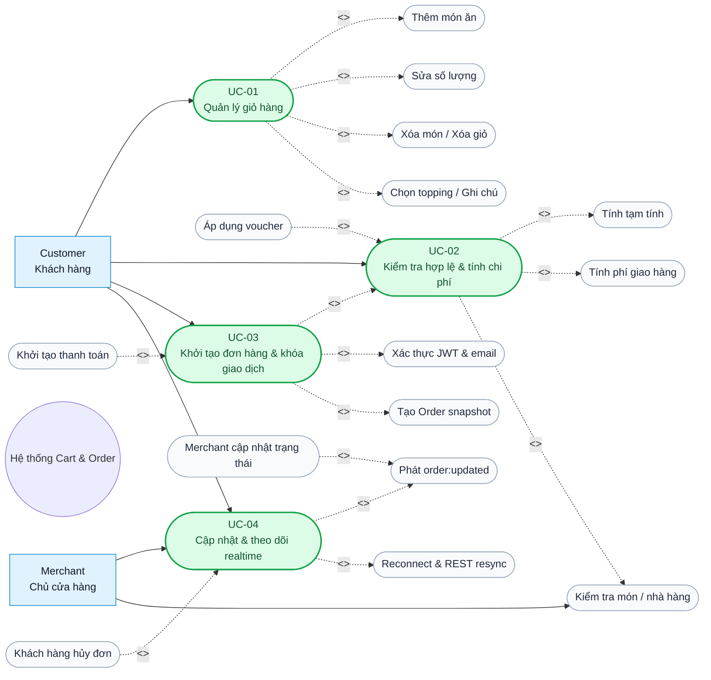

# 2.3. Đặc tả yêu cầu phân hệ Giỏ hàng và Đơn hàng

## 1. Khái niệm & Đặt vấn đề

Trong hệ thống thương mại điện tử F&B, Giỏ hàng và Đơn hàng là phân hệ chuyển đổi trực tiếp từ nhu cầu của khách hàng thành giao dịch có giá trị. Khác với một chức năng tra cứu thông thường, phân hệ này phải xử lý đồng thời giá món ăn, phí giao hàng, mã giảm giá, địa chỉ nhận hàng, phương thức thanh toán và trạng thái vận hành của nhà hàng. Một sai lệch nhỏ trong yêu cầu có thể dẫn đến chênh lệch số tiền, tạo trùng đơn hoặc hiển thị trạng thái không thống nhất giữa khách hàng và chủ cửa hàng.

Việc xác lập yêu cầu chính xác còn quan trọng vì module có nhiều điểm giao tiếp: dữ liệu `MenuItem` và `Restaurant` đến từ phân hệ Merchant; JWT và `userId` đến từ Auth; kết quả checkout được chuyển sang Payment; trạng thái đơn được phát qua Socket.IO và được Review sử dụng để xác định điều kiện đánh giá. Do đó, đặc tả cần phân biệt rõ hành vi đã có trong repository với yêu cầu cần hoàn thiện, đồng thời quy định các chỉ tiêu đo lường để kiểm chứng.

Phạm vi khảo sát bao gồm các endpoint dưới `/api/cart`, `/api/orders`, các endpoint đơn hàng phía `/api/owner`, middleware xác thực, Zod validation, service `cartService`, `orderService` và Socket.IO. Repository không sử dụng Joi trong các luồng này. `reviewSchema`, `menuItemSchema` và schema cập nhật trạng thái owner dùng Zod; nhiều payload Cart/Checkout hiện được kiểm tra thủ công bằng TypeScript và điều kiện runtime.

## 2. Đặc tả chi tiết

### 2.1. Sơ đồ ca sử dụng

Các ca sử dụng của module và quan hệ giữa Customer, Merchant với hệ thống được mô tả tại Hình 2.2. Quan hệ `include` biểu diễn bước bắt buộc trong luồng; quan hệ `extend` biểu diễn hành vi tùy chọn hoặc phát sinh theo điều kiện.

**Hình 2.2: Sơ đồ ca sử dụng phân hệ Quản lý Giỏ hàng và Đơn hàng**

Trong hiện trạng, `POST /api/cart` đã kiểm tra `menuItemId`, `restaurantId`, số lượng và xung đột khác nhà hàng; `POST /api/cart/apply-coupon` đã kiểm tra mã, thời hạn, trạng thái và `minOrderAmount`. Tuy nhiên, topping và ghi chú chưa được truyền vào `Cart`: `Order` hiện tạo `selectedOptions: []` và `note: null`. Đây là yêu cầu chức năng cần bổ sung nếu nghiệp vụ bắt buộc lưu tùy chọn món.

### 2.1.1. Cross-check với Slice 1: ERD và API

Để bảo đảm đặc tả không mô tả vượt quá thiết kế dữ liệu và API đã trình bày ở Chương 3, các ca sử dụng được đối chiếu với `docs/report/3.2.2_erd_design.md` và `docs/report/3.3.1_order_logic.md`. Kết quả đối chiếu được chuẩn hóa như sau:

**Bảng 2.1a: Đối chiếu Use Case, trường dữ liệu ERD và endpoint thực tế**

| Use Case | Trường dữ liệu khớp ERD | Endpoint / interface khớp API | Kết luận hiện trạng |
| --- | --- | --- | --- |
| UC-01 – Quản lý giỏ hàng | `Cart.userId`, `Cart.restaurantId`, `Cart.items[]`, `CartItem.menuItemId`, `quantity`, `price`, `subtotal`, `discountAmount`, `grandTotal`, `couponId` | `GET/POST /api/cart`, `PATCH/DELETE /api/cart/items/:menuItemId`, `DELETE /api/cart` | Khớp. `CartItem` chưa có `selectedOptions` hoặc `note`; topping/ghi chú chỉ tồn tại ở `OrderItemSnapshot` và hiện chưa được ánh xạ từ Cart. |
| UC-02 – Tính chi phí | `Cart.subtotal`, `discountAmount`, `grandTotal`; `Restaurant.deliveryFee`; `Coupon.discountType`, `discountValue`, `minOrderAmount`, `maxDiscountAmount`, `startsAt`, `endsAt`, `status` | `POST /api/cart/apply-coupon`, `POST /api/cart/calculate-checkout` | Khớp với ERD và service. `calculate-checkout` hiện trả `deliveryFee`, `finalTotal`; payload `addressId` chưa làm thay đổi phí. |
| UC-03 – Tạo đơn | `Order.orderNumber`, `checkoutKey`, `customerId`, `restaurantId`, `customerSnapshot`, `restaurantSnapshot`, `recipient`, `items[]`, `couponId`, `couponSnapshot`, `pricing`, `paymentMethod`, `paymentStatus`, `orderStatus`, `statusHistory`, timestamps | `POST /api/orders/checkout` | Khớp. `checkoutKey` là khóa do server sinh; chưa nhận `Idempotency-Key`. `CouponUsage` có trong ERD nhưng checkout hiện chưa ghi document usage. |
| UC-04 – Trạng thái realtime | `Order.orderStatus`, `statusHistory[]`, `changedBy`, `changedByRole`, `reason`, `note`, `changedAt`, `confirmedAt`, `deliveredAt`, `cancelledAt` | Merchant: `PATCH /api/owner/restaurants/:restaurantId/orders/:orderId/status`; Customer: `POST /api/orders/:id/cancel`, `GET /api/orders/:id`; Socket.IO: `join:order`, `order:updated` | Khớp với route và model. Server emit tới `restaurant:{restaurantId}` nhưng hiện chưa có listener `join:restaurant`; đây là khoảng trống tích hợp, không phải endpoint đã hoàn thiện. |

Các trường `Order.recipient` gồm `fullName`, `phone`, `addressText`, `ward`, `district`, `city`, `location`, `note`; vì vậy `note` trong request checkout được hiểu là ghi chú giao hàng và được lưu tại `recipient.note`, không phải ghi chú của từng món. Ngược lại, `Order.items[].selectedOptions` và `Order.items[].note` là trường của snapshot dòng món theo ERD; chúng chỉ được xem là dữ liệu đầu vào hợp lệ sau khi API Cart bổ sung schema và cơ chế lưu tương ứng. Trong ERD, `Restaurant.deliveryFee` là tên biểu diễn nghiệp vụ; trong API/service hiện tại, trường vật lý tương ứng được đọc dưới dạng `restaurant.delivery.fee`.

Tên endpoint được giữ đúng theo Slice 1: tạo đơn dùng `POST /api/orders/checkout`, không thay bằng `POST /api/orders`; chi tiết Customer dùng `GET /api/orders/:id`, trong khi route review dùng `:orderId`; endpoint Merchant cập nhật trạng thái dùng đầy đủ tiền tố `/api/owner/restaurants/:restaurantId/orders/:orderId/status`.

### 2.2. Danh mục yêu cầu chức năng

**Bảng 2.1: Danh mục Functional Requirements theo MoSCoW**

| Mã yêu cầu | Tên yêu cầu | Mô tả kiểm chứng | Ưu tiên |
| --- | --- | --- | :---: |
| FR-01 | Xem giỏ hàng | `GET /api/cart` trả giỏ của đúng `userId`; giỏ rỗng trả cấu trúc tổng tiền bằng 0. | Must |
| FR-02 | Thêm món vào giỏ | `POST /api/cart` kiểm tra ObjectId, số lượng nguyên dương, món tồn tại và thuộc `restaurantId`. | Must |
| FR-03 | Giới hạn một nhà hàng | Không trộn món từ hai nhà hàng; trả `409` nếu chưa xác nhận thay thế, hỗ trợ `replace=true` khi người dùng xác nhận. | Must |
| FR-04 | Sửa số lượng | `PATCH /api/cart/items/:menuItemId` cập nhật số lượng; số lượng `<= 0` được quy ước là xóa món. | Must |
| FR-05 | Xóa món và xóa giỏ | `DELETE /api/cart/items/:menuItemId` xóa item; `DELETE /api/cart` xóa toàn bộ cart và trả `204`. | Must |
| FR-06 | Topping và ghi chú món | **Yêu cầu mở rộng:** bổ sung `selectedOptions` và `note` vào payload/cart item; sau đó lưu vào `Order.items[].selectedOptions` và `Order.items[].note` theo ERD. Hiện `CartItem` chưa có hai trường này và checkout đang gán `[]`/`null`. | Should |
| FR-07 | Tính giá giỏ hàng | Tính `subtotal`, `discountAmount`, `grandTotal` từ dữ liệu server, không tin tổng tiền do client gửi. | Must |
| FR-08 | Áp dụng voucher | `POST /api/cart/apply-coupon` kiểm tra `status`, `startsAt`, `endsAt`, `minOrderAmount`, loại giảm và mức trần. | Must |
| FR-09 | Tính phí checkout | `POST /api/cart/calculate-checkout` trả `deliveryFee` và `finalTotal` từ cart/restaurant. | Must |
| FR-10 | Tạo Order snapshot | `POST /api/orders/checkout` tạo snapshot khách hàng, nhà hàng, món, coupon, pricing và `statusHistory`. | Must |
| FR-11 | Khóa giao dịch checkout | Một lần checkout hợp lệ chỉ được chuyển cart thành một order; thiết kế mục tiêu ánh xạ `Idempotency-Key` của client vào cơ chế chống trùng, còn `Order.checkoutKey` hiện là khóa do server sinh và có unique index kết hợp `customerId`. | Should |
| FR-12 | Thanh toán | Hỗ trợ COD và tạo `paymentUrl` cho VNPAY; payment status phải phản ánh kết quả thực tế. | Must |
| FR-13 | Xem lịch sử và chi tiết đơn | `GET /api/orders` phân trang; `GET /api/orders/:id` chỉ cho Customer sở hữu đơn truy cập. | Must |
| FR-14 | Hủy đơn và reorder | Customer chỉ hủy được `pending`; reorder kiểm tra nhà hàng hoạt động và bỏ qua món không còn bán. | Must |
| FR-15 | Merchant cập nhật trạng thái | Owner cập nhật theo transition hợp lệ qua `/api/owner/restaurants/:restaurantId/orders/:orderId/status`. | Must |
| FR-16 | Theo dõi realtime | Phát `order:updated` sau khi lưu Order; client reconnect, join lại room và REST resync. | Must |
| FR-17 | Đánh giá sau giao hàng | Review dùng `rating` 1–5, content 3–1000 ký tự và chỉ hợp lệ với đơn đủ điều kiện. | Should |
| FR-18 | Driver delivery integration | Chuẩn hóa event/API bàn giao order snapshot và trạng thái giao hàng cho module Driver. | Could |
| FR-19 | Tự động hủy VNPAY quá hạn | Hủy đơn `pending/unpaid` quá thời gian thanh toán và phát cập nhật trạng thái. | Should |
| FR-20 | Xác nhận tồn kho | Kiểm tra và decrement tồn kho nguyên tử khi checkout nếu nghiệp vụ bổ sung `stock`; hiện ERD `MENU_ITEM` chưa có trường tồn kho. | Should |

### 2.3. Đặc tả các Use Case điển hình

#### UC-01: Quản lý giỏ hàng

**Bảng 2.2: Đặc tả Use Case UC-01**

| Thành phần | Đặc tả |
| --- | --- |
| Tác nhân | Customer |
| Tiền điều kiện | Customer đã đăng nhập bằng JWT hợp lệ; `menuItemId` và `restaurantId` hợp lệ khi thêm món. |
| Luồng cơ bản | 1. Customer chọn món và số lượng. 2. Client gọi `POST /api/cart`. 3. Service kiểm tra món và nhà hàng. 4. Hệ thống tạo hoặc cập nhật `Cart`. 5. Hệ thống tính lại `subtotal`, voucher và `grandTotal`. 6. Customer có thể sửa bằng `PATCH`, xóa item bằng `DELETE /items/:menuItemId` hoặc xóa toàn bộ bằng `DELETE /api/cart`. |
| Luồng ngoại lệ | Món không tồn tại: `404`; ID không hợp lệ hoặc số lượng không dương: `400`; món không thuộc nhà hàng: `400`; cart đang chứa nhà hàng khác: `409` trừ khi có `replace=true`; cart/item không tồn tại khi sửa/xóa: `404`. Topping và ghi chú chưa được lưu trong hiện trạng, cần trả lỗi validation nếu payload được mở rộng nhưng không hợp lệ. |
| Hậu điều kiện | Cart thuộc một Customer và một Restaurant, mỗi `CartItem` có `menuItemId`, `quantity`, `price`, tổng tiền được lưu lại; voucher không còn hợp lệ sẽ bị gỡ khỏi cart. Topping/ghi chú món chưa được lưu vì chưa có trường tương ứng trong `CartItem`. |

#### UC-02: Kiểm tra tính hợp lệ và tính toán chi phí đơn hàng

**Bảng 2.3: Đặc tả Use Case UC-02**

| Thành phần | Đặc tả |
| --- | --- |
| Tác nhân | Customer; Merchant cung cấp dữ liệu Menu/Restaurant |
| Tiền điều kiện | Cart tồn tại và có ít nhất một item; dữ liệu `restaurant.delivery.fee` có thể truy cập. |
| Luồng cơ bản | 1. Hệ thống đọc Cart theo `userId`. 2. Tính `subtotal` từ `CartItem.price × quantity`. 3. Revalidate voucher theo trạng thái, thời gian, ngưỡng đơn tối thiểu và loại giảm. 4. Đọc `Restaurant.deliveryFee` từ dữ liệu nhà hàng. 5. Trả `deliveryFee` và `finalTotal` cho màn hình checkout. |
| Luồng ngoại lệ | Cart trống: `400`; thiếu nhà hàng hoặc phí giao hàng: `404`; voucher không tồn tại/hết hạn/không đạt ngưỡng: `404` hoặc `400`; discount không hợp lệ được đưa về 0 và coupon bị gỡ. |
| Hậu điều kiện | Customer nhận được pricing do server tính; client không có quyền quyết định `grandTotal`. |

#### UC-03: Khởi tạo đơn hàng và khóa giao dịch

**Bảng 2.4: Đặc tả Use Case UC-03**

| Thành phần | Đặc tả |
| --- | --- |
| Tác nhân | Customer; Payment Service |
| Tiền điều kiện | JWT hợp lệ, tài khoản không bị khóa, email đã xác minh, Cart không rỗng, payload có `deliveryAddress` và `paymentMethod`. |
| Luồng cơ bản | 1. Customer xác nhận checkout. 2. Route chạy `verifyToken` và `requireVerifiedEmail`. 3. Controller gọi `createOrderFromCart`. 4. Service đọc Cart/User/Restaurant/MenuItem. 5. Tạo `customerSnapshot`, `restaurantSnapshot`, `recipient`, item snapshot, coupon snapshot và `pricing`. 6. Lưu `Order` với `pending` và `statusHistory`. 7. Xóa Cart. 8. Với VNPAY, tạo `paymentUrl`; với COD, kích hoạt email xác nhận. |
| Luồng ngoại lệ | Thiếu địa chỉ/phương thức thanh toán: `400`; token thiếu hoặc hết hạn: `401`; email chưa xác minh: `403`; Cart rỗng: `400`; user/restaurant không hợp lệ: `404` hoặc `500`; lỗi duplicate/validation MongoDB: `409` hoặc `400`; thanh toán VNPAY không hoàn tất thì đơn có thể bị auto-cancel theo safety-net. Hiện chưa có transaction xuyên Order–Cart và chưa xử lý `Idempotency-Key`; đây là rủi ro cần khắc phục. |
| Hậu điều kiện | Một `Order` có `orderNumber`, `checkoutKey`, `customerId`, `restaurantId`, các snapshot, `recipient`, `items`, `pricing`, payment/status và `statusHistory`; Cart được xóa sau khi lưu Order. Hiện chưa ghi `CouponUsage`; thiết kế mục tiêu phải bảo đảm thao tác Order–Cart atomic và retry-safe. |

#### UC-04: Cập nhật và theo dõi trạng thái đơn hàng thời gian thực

**Bảng 2.5: Đặc tả Use Case UC-04**

| Thành phần | Đặc tả |
| --- | --- |
| Tác nhân | Merchant; Customer; Socket.IO Server |
| Tiền điều kiện | Merchant có JWT và sở hữu Restaurant; Customer là chủ Order; Order tồn tại. |
| Luồng cơ bản | 1. Merchant gọi `PATCH /api/owner/restaurants/:restaurantId/orders/:orderId/status`. 2. Service kiểm tra `Order.restaurantId` thuộc restaurant và transition hợp lệ. 3. Lưu `orderStatus` cùng `statusHistory`. 4. Gọi `emitOrderUpdate`. 5. Socket.IO phát `order:updated` tới `order:{orderId}` và `restaurant:{restaurantId}`. 6. Customer nhận event và cập nhật UI. |
| Luồng ngoại lệ | Order không thuộc restaurant: `404`; transition sai: `409`; hủy không có reason: `400`; Customer hủy sau `pending`: `400`; JWT/role sai: `401/403`; socket mất kết nối: client reconnect, join lại room và gọi `GET /api/orders/:id` để resync. Hiện server chưa có listener `join:restaurant`, nên merchant dashboard cần hoàn thiện contract room. |
| Hậu điều kiện | Trạng thái mới được lưu trước khi phát event; Customer và Merchant nhìn thấy trạng thái gần nhất, hoặc khôi phục qua REST khi event bị bỏ lỡ. |

### 2.4. Đối chiếu endpoint và validation

**Bảng 2.6: API endpoint và cơ chế kiểm tra hiện tại**

| Endpoint | Chức năng | Validation / authorization hiện tại |
| --- | --- | --- |
| `GET /api/cart` | Lấy cart Customer | `verifyToken`; truy vấn theo `req.user.userId`. |
| `POST /api/cart` | Thêm món | Kiểm tra ObjectId, quantity nguyên dương, món tồn tại, đúng Restaurant; dữ liệu được lưu vào `CartItem.menuItemId`, `quantity`, `price`; chưa có Zod schema route. |
| `PATCH /api/cart/items/:menuItemId` | Sửa quantity | Kiểm tra param là string; service coi `quantity <= 0` là xóa; chưa giới hạn kiểu/số lượng bằng Zod. |
| `DELETE /api/cart/items/:menuItemId` | Xóa item | Kiểm tra param; service lọc item theo cart của user. |
| `DELETE /api/cart` | Xóa cart | `verifyToken`; không có cart vẫn xem là thành công. |
| `POST /api/cart/apply-coupon` | Áp voucher | Controller yêu cầu `couponCode`; service kiểm tra code, status, thời hạn, min order và discount cap. |
| `POST /api/cart/calculate-checkout` | Tính phí | Đọc cart và `restaurant.delivery.fee`; payload `addressId` hiện chưa được dùng để tính phí. |
| `GET /api/orders` | Lịch sử order | `verifyToken`; page/limit parse thủ công, limit tối đa 50 trong service; status chưa có enum schema. |
| `POST /api/orders/checkout` | Tạo order | `verifyToken` + `requireVerifiedEmail`; controller chỉ kiểm tra `deliveryAddress` và `paymentMethod`; chưa có Zod schema đầy đủ; chưa nhận `Idempotency-Key` và chưa ghi `CouponUsage`. |
| `GET /api/orders/:id` | Chi tiết order | Kiểm tra ObjectId và ownership theo `customerId`. |
| `POST /api/orders/:id/cancel` | Customer hủy order | Email verified, reason bắt buộc; service chỉ cho hủy `pending`. |
| `POST /api/orders/:orderId/reorder` | Đưa order cũ vào cart | Email verified; kiểm tra ObjectId, nhà hàng approved/open và availability món. |
| `GET/POST/PATCH/DELETE /api/orders/:orderId/review` | Review của order | `reviewSchema` Zod: rating 1–5, content 3–1000, `.strict()`. |
| `GET /api/owner/restaurants/:restaurantId/orders` | Merchant xem order | `verifyToken` + `requireRole(['restaurant_owner'])`; giới hạn restaurant qua `findOwnedRestaurant`; query search escape regex. |
| `PATCH /api/owner/restaurants/:restaurantId/orders/:orderId/status` | Merchant đổi status | Zod enum `confirmed/preparing/delivering/delivered/cancelled`; reason/note tối đa 500; service kiểm tra transition và ownership. |

### 2.5. Bảng kịch bản chi tiết cho hai Use Case cốt lõi

**Bảng 2.7: Kịch bản kiểm thử UC-03 – Tạo đơn và khóa giao dịch**

| Bước | Tác nhân / thành phần | Dữ liệu vào | Kết quả mong đợi |
| ---: | --- | --- | --- |
| 1 | Customer | Cart có item, địa chỉ hợp lệ, `paymentMethod = COD` | Request checkout được gửi kèm JWT. |
| 2 | Middleware | Authorization header | Token hợp lệ, user không locked, email đã verified. |
| 3 | Order Service | `userId` | Đọc Cart, User, Restaurant và dữ liệu item; không dùng tổng tiền do client tự gửi. |
| 4 | Pricing logic | item price, coupon, delivery fee | Tính `subtotal`, `discountAmount`, `deliveryFee`, `grandTotal`. |
| 5 | Order model | snapshot và status `pending` | Tạo Order có `orderNumber`, `checkoutKey`, `statusHistory`. |
| 6 | Cart Service | `userId` | Xóa Cart sau khi Order lưu thành công. |
| 7 | Side effect | COD/VNPAY | COD gửi email; VNPAY trả `paymentUrl`; response `201`. |
| 8 | Retry/concurrency mục tiêu | cùng `Idempotency-Key` | Chỉ có một Order; request lặp trả kết quả Order đã tạo, không tạo giao dịch thứ hai. |

**Bảng 2.8: Kịch bản kiểm thử UC-04 – Cập nhật trạng thái và realtime**

| Bước | Tác nhân / thành phần | Dữ liệu vào | Kết quả mong đợi |
| ---: | --- | --- | --- |
| 1 | Merchant | `restaurantId`, `orderId`, `status = confirmed` | Middleware xác thực đúng role và restaurant ownership. |
| 2 | Owner controller | `reason`, `note` tùy chọn | Kiểm tra param và chuyển request đến `updateOrderStatusByOwner`. |
| 3 | Order Service | trạng thái hiện tại `pending` | Cho phép `pending → confirmed`; transition không hợp lệ trả `409`. |
| 4 | MongoDB | Order + statusHistory | Lưu trạng thái mới và thời gian thay đổi trước khi emit. |
| 5 | Socket service | OrderDetail | Phát `order:updated` tới room order và room restaurant. |
| 6 | Customer client | event payload | Cập nhật chi tiết đơn gần realtime. |
| 7 | Mất kết nối | disconnect/reconnect | Client rejoin `order:{orderId}` và gọi REST detail để lấy trạng thái chuẩn. |
| 8 | Customer hủy | `POST /api/orders/:id/cancel` | Chỉ thành công khi order còn `pending`; sau save cũng phát `order:updated`. |

### 2.6. Đặc tả yêu cầu phi chức năng

**Bảng 2.9: Tổng hợp Non-Functional Requirements và tiêu chuẩn đo lường**

| Mã NFR | Nhóm | Metric | Target | Phương pháp kiểm chứng |
| --- | --- | --- | --- | --- |
| NFR-01 | Hiệu năng API | p95 latency cho Cart/Order API | `< 200 ms` trong tải chuẩn, không tính thời gian provider thanh toán ngoài hệ thống | Load test bằng k6/Artillery; đo riêng p50, p95, p99 cho từng endpoint. |
| NFR-02 | Throughput | Request xử lý ổn định | Tối thiểu 100 RPS cho read cart/order và 30 RPS cho checkout trong môi trường benchmark | Chạy test 5–10 phút, theo dõi latency, error rate và CPU/RAM. |
| NFR-03 | Concurrency | Checkout đồng thời cùng một cart | Không tạo quá một Order thành công cho cùng `Idempotency-Key`; duplicate rate = `0%` | Test 50–100 request đồng thời; kiểm tra unique index, transaction log và số Order thực tế. |
| NFR-04 | Data consistency | Tồn kho khi nhiều user đặt cùng món | Over-selling = `0` khi MenuItem có stock; decrement phải atomic | Dùng atomic conditional update hoặc reservation transaction; đối chiếu stock đầu-cuối và Order item. |
| NFR-05 | Atomicity | Order–Cart conversion | Không có trạng thái Order đã tạo nhưng Cart vẫn còn do lỗi giữa chừng | Fault injection giữa `Order.save()` và `clearCart`; xác minh MongoDB transaction/compensation. |
| NFR-06 | Realtime | Độ trễ `order:updated` | p95 `< 1 s` sau khi commit Order trong cùng instance | Gắn timestamp server/client, đo qua Socket.IO trong test tích hợp. |
| NFR-07 | Availability | Reconnect và resync | Tự reconnect tối đa 5 lần theo cấu hình hiện tại; sau reconnect REST resync thành công `>= 99%` | Ngắt mạng có kiểm soát, đo số lần join lại và trạng thái cuối cùng trên UI. |
| NFR-08 | Graceful degradation | Mất WebSocket | REST detail vẫn cung cấp trạng thái chuẩn; UI không mất Order cuối cùng | Chặn Socket.IO, gọi `GET /api/orders/:id`, kiểm tra UI hiển thị dữ liệu cache và trạng thái reconnect. |
| NFR-09 | Authentication | Request không JWT hợp lệ | 100% request private bị từ chối với `401`; token hết hạn không được chấp nhận | Security integration test với thiếu token, token giả, token hết hạn và user locked. |
| NFR-10 | Authorization | Phân quyền theo `userId`/`merchantId` | Không đọc/sửa được Cart/Order của owner khác; unauthorized access = `0` | Test IDOR với user khác và owner khác restaurant; kiểm tra response `403/404`. |
| NFR-11 | Input validation | Dữ liệu ngoài schema | 100% payload sai bị chặn trước ghi DB; không thực thi NoSQL operator/injection | Fuzz test ObjectId, quantity, string, regex search, `$where`/operator keys; dùng Zod strict cho payload mở rộng. |
| NFR-12 | Auditability | Status history | Mỗi transition hợp lệ có actor, role, timestamp và trạng thái trước/sau | Kiểm tra `statusHistory` sau từng transition và đối chiếu log correlation. |
| NFR-13 | Reliability | Side effect sau commit | Email/payment/socket lỗi không làm mất Order đã commit; lỗi phải được log | Mock provider lỗi, kiểm tra Order vẫn tồn tại và cơ chế retry/log. |

Các target trên là tiêu chí nghiệm thu đề xuất. Khi benchmark thực tế chưa được thực hiện, kết quả cần ghi rõ là số liệu đo trong môi trường kiểm thử, không suy diễn thành thông số production.

## 3. Đánh giá & Khả thi

### 3.1. Tính khả thi kỹ thuật

Các yêu cầu cơ bản có tính khả thi cao trên nền tảng hiện tại. Express và TypeScript đã có route/controller/service rõ ràng; Mongoose hỗ trợ schema, index và atomic update; MongoDB phù hợp với snapshot `Order` và lịch sử trạng thái; Socket.IO đã có JWT handshake, room theo order và reconnect ở client. Vì vậy, FR-01 đến FR-05, FR-07 đến FR-09, FR-12 đến FR-17 có thể tiếp tục phát triển theo cấu trúc hiện hữu mà không cần thay đổi nền tảng.

Zod đã được sử dụng trong `orderRoutes` cho review và `ownerRoutes` cho status/menu. Việc bổ sung Zod schema cho `AddToCartRequest`, `UpdateCartItemRequest`, `ApplyCouponRequest`, `CalculateCheckoutPayload`, `CreateOrderPayload` và `CancelOrderPayload` là khả thi, đồng thời giúp thống nhất cách trả lỗi `400` qua `errorHandler`.

### 3.2. Các điểm cần hoàn thiện để đạt NFR

- **Checkout atomicity và idempotency:** hiện `Order.save()` và `clearCart()` là hai thao tác riêng; cần MongoDB transaction với replica set, `Idempotency-Key` ổn định theo Customer và unique constraint phù hợp.
- **Over-selling:** model `MenuItem` hiện chưa có trường stock trong luồng khảo sát; cần bổ sung inventory model hoặc reservation/atomic decrement trước khi cam kết NFR-04.
- **Input validation:** các controller Cart/Checkout đang dùng type assertion và kiểm tra thủ công; cần schema Zod `.strict()`, giới hạn độ dài chuỗi, số lượng tối đa và kiểm tra ObjectId trước khi truy vấn.
- **Realtime Merchant:** service đang emit đến `restaurant:{restaurantId}` nhưng `socket.ts` mới hiện thực `join:order`; cần thêm `join:restaurant` với authorization theo `restaurantId`, acknowledgement lỗi và kiểm thử room isolation.
- **Concurrency status:** `updateOrderStatusByOwner` hiện đọc trạng thái, sửa document và `save()`; nên chuyển sang conditional update/optimistic locking để tránh hai actor cùng chuyển một Order từ một trạng thái cũ.
- **Latency:** p95 dưới 200 ms có thể đạt với index hiện có, payload hợp lý và MongoDB cùng vùng mạng; không nên tính thời gian VNPAY/SMTP vào latency API nội bộ. Cần đo bằng load test thay vì chỉ suy luận từ code.

### 3.3. Kết luận

Đặc tả yêu cầu của module Cart & Order có nền tảng triển khai phù hợp với Node.js, MongoDB/Mongoose và Socket.IO. Các luồng nghiệp vụ cốt lõi đã hiện diện, gồm quản lý cart, coupon, checkout, Order snapshot, merchant status transition và realtime update. Khoảng cách chính giữa hiện trạng và mức yêu cầu production nằm ở validation nhất quán, transaction, idempotency, inventory concurrency và authorization cho room Merchant.

Theo thứ tự ưu tiên, nhóm nên hoàn thiện schema validation và contract test trước; tiếp theo bổ sung transaction/idempotency cho checkout; sau đó triển khai atomic inventory nếu nghiệp vụ yêu cầu; cuối cùng hoàn thiện `join:restaurant`, resync và benchmark p95. Với lộ trình này, yêu cầu chức năng có thể kiểm thử độc lập, còn các yêu cầu phi chức năng có thể được nghiệm thu bằng số liệu thay vì đánh giá cảm tính.
