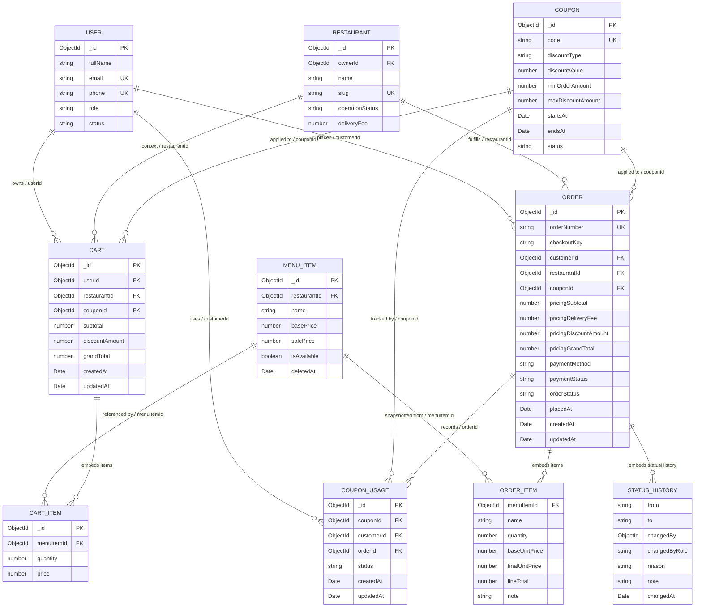

# 3.2.2. Thiết kế lược đồ quan hệ thực thể phân hệ Giỏ hàng và Đơn hàng

> **Phạm vi khảo sát:** Nội dung được tổng hợp từ các Mongoose model và service trong `server/src/models/`, `server/src/repositories/` và `server/src/services/`. Repository hiện sử dụng MongoDB/Mongoose, không có `schema.prisma` hoặc thư mục migration quan hệ. Không tìm thấy `style_guide.md` trong repository; vì vậy tài liệu này giữ quy ước trình bày tiếng Việt, bảng dữ liệu và cách đánh số mục đang được sử dụng trong tài liệu dự án.

## 1. Khái niệm & Đặt vấn đề

Phân hệ Giỏ hàng và Đơn hàng phải lưu trữ xuyên suốt vòng đời của một giao dịch đặt món: khách hàng chọn món thuộc một nhà hàng, điều chỉnh số lượng, áp dụng mã giảm giá, xác nhận địa chỉ và phương thức thanh toán, sau đó theo dõi trạng thái xử lý đơn. Dữ liệu trong giỏ hàng mang tính tạm thời, trong khi dữ liệu đơn hàng phải bảo toàn lịch sử tại thời điểm đặt hàng kể cả khi tên món, giá món, thông tin nhà hàng hoặc mã giảm giá thay đổi về sau.

Thiết kế hiện tại chọn MongoDB với các document `Cart`, `Order`, `Coupon` và `CouponUsage`. `CartItem`, `OrderItemSnapshot` và `StatusHistory` được nhúng (embedded subdocument), giúp đọc toàn bộ giỏ hàng hoặc chi tiết đơn hàng trong một truy vấn. Các trường `customerSnapshot`, `restaurantSnapshot`, `recipient` và `couponSnapshot` trong `Order` là bản chụp dữ liệu (snapshot), nhằm bảo đảm tính bất biến của hóa đơn nghiệp vụ.

Các yêu cầu nhất quán chính gồm:

- Mỗi giỏ hàng chỉ chứa món của một nhà hàng; service hiện thực quy tắc đổi nhà hàng bằng thao tác thay thế giỏ hàng khi người dùng xác nhận.
- Số lượng món phải là số nguyên dương; giá và các thành tiền không âm.
- Đơn hàng phải có ít nhất thông tin khách hàng, nhà hàng, món, giá, phương thức thanh toán và trạng thái.
- Mã đơn hàng duy nhất; cặp `customerId`–`checkoutKey` duy nhất để tránh tạo trùng trong cùng một phiên checkout.
- Việc chuyển trạng thái đơn hàng phải tuân theo luồng nghiệp vụ và lưu vết trong `statusHistory`.
- Dữ liệu tham chiếu giữa document được kiểm soát ở tầng ứng dụng; MongoDB không áp dụng FK vật lý như hệ quản trị quan hệ.

## 2. Thiết kế chi tiết & Hiện thực

### 2.1. Lược đồ ERD

Sơ đồ dưới đây biểu diễn các collection chính và các subdocument có ý nghĩa nghiệp vụ. Ký hiệu `||--o{` thể hiện quan hệ một-nhiều; quan hệ giữa collection và subdocument được ghi chú là `embeds`.

**Hình 3.2: Lược đồ quan hệ thực thể (ERD) phân hệ Giỏ hàng và Đơn hàng**

Trong triển khai Mongoose, `FK` trên sơ đồ là khóa tham chiếu logic (`ObjectId` kèm `ref`), không phải ràng buộc khóa ngoại vật lý. `ORDER_ITEM` và `STATUS_HISTORY` không có `_id` riêng vì schema đặt `{ _id: false }`; `_id` của `CART_ITEM` vẫn được Mongoose tạo mặc định. `customerSnapshot`, `restaurantSnapshot`, `recipient`, `pricing`, `couponSnapshot` và `cancellation` là các object nhúng bổ sung của `ORDER`, được mô tả trong từ điển dữ liệu dưới đây.

### 2.2. Từ điển dữ liệu

#### 2.2.1. Collection `Cart`

| Tên cột | Kiểu dữ liệu | Nullable | Mô tả |
| --- | --- | --- | --- |
| `_id` | `ObjectId` | Không | Khóa chính MongoDB, do Mongoose tự sinh. |
| `userId` | `ObjectId` | Không | Tham chiếu logic đến `User`; chủ sở hữu giỏ hàng. |
| `restaurantId` | `ObjectId` | Không | Tham chiếu logic đến `Restaurant`; giỏ hàng chỉ gắn với một nhà hàng. |
| `items` | `CartItem[]` | Không | Danh sách món nhúng; schema mặc định là mảng rỗng. |
| `items[].menuItemId` | `ObjectId` | Không | Tham chiếu logic đến `MenuItem`. |
| `items[].quantity` | `number` | Không | Số lượng món, `min: 1`. |
| `items[].price` | `number` | Không | Giá được chụp tại thời điểm thêm vào giỏ, `min: 0`. |
| `subtotal` | `number` | Không | Tổng tiền món trước giảm giá, mặc định `0`. |
| `discountAmount` | `number` | Không | Giá trị giảm giá, mặc định `0`. |
| `grandTotal` | `number` | Không | Tổng sau giảm giá, mặc định `0`. |
| `couponId` | `ObjectId` | Có | Tham chiếu logic đến `Coupon`; `null` nếu chưa áp dụng hoặc coupon không còn hợp lệ. |
| `createdAt` | `Date` | Không | Timestamp do `{ timestamps: true }`. |
| `updatedAt` | `Date` | Không | Timestamp cập nhật cuối. |

#### 2.2.2. Collection `Order`

| Tên cột | Kiểu dữ liệu | Nullable | Mô tả |
| --- | --- | --- | --- |
| `_id` | `ObjectId` | Không | Khóa chính MongoDB. |
| `orderNumber` | `string` | Không | Mã đơn hiển thị, có unique index. |
| `checkoutKey` | `string` | Không | Khóa định danh phiên checkout; duy nhất khi kết hợp với `customerId`. |
| `customerId` | `ObjectId` | Không | Tham chiếu logic đến `User`. Đây là tên trường thực tế dùng để truy vấn lịch sử theo người dùng. |
| `restaurantId` | `ObjectId` | Không | Tham chiếu logic đến `Restaurant`. |
| `customerSnapshot` | `object` | Không | Bản chụp `fullName`, `email`, `phone` tại lúc đặt hàng. |
| `restaurantSnapshot` | `object` | Không | Bản chụp `name`, `phone`, `logoUrl`, `addressText` của nhà hàng. |
| `recipient` | `object` | Không | Thông tin người nhận và địa chỉ giao hàng; có `fullName`, `phone`, `addressText`, `ward`, `district`, `city`, `location`, `note`. |
| `items` | `OrderItemSnapshot[]` | Không | Các dòng hàng nhúng, lưu giá và thông tin món tại thời điểm đặt. |
| `items[].menuItemId` | `ObjectId` | Không | Tham chiếu logic về món gốc để đối chiếu hoặc đặt lại; không thay thế snapshot. |
| `items[].name` | `string` | Không | Tên món tại thời điểm đặt. |
| `items[].imageUrl` | `string` | Có | Ảnh món tại thời điểm đặt. |
| `items[].quantity` | `number` | Không | Số lượng, `min: 1`. |
| `items[].baseUnitPrice` | `number` | Không | Giá niêm yết trên một đơn vị, `min: 0`. |
| `items[].selectedOptions` | `SelectedOption[]` | Không | Các lựa chọn món; mỗi phần tử có `groupId`, `optionId`, tên và `priceDelta`. |
| `items[].finalUnitPrice` | `number` | Không | Giá cuối của một đơn vị sau lựa chọn, `min: 0`. |
| `items[].lineTotal` | `number` | Không | Thành tiền của dòng hàng, `min: 0`. |
| `items[].note` | `string` | Có | Ghi chú cho dòng món. |
| `couponId` | `ObjectId` | Có | Tham chiếu logic đến `Coupon`. |
| `couponSnapshot` | `object` | Có | Bản chụp mã, tên, loại và giá trị giảm giá. |
| `pricing` | `object` | Không | Gồm `subtotal`, `deliveryFee`, `discountAmount`, `grandTotal`, `currency`; các số tiền không âm. |
| `paymentMethod` | `enum string` | Không | `cod`, `vnpay`, `momo`, `stripe` hoặc `mock`. |
| `paymentStatus` | `enum string` | Không | `unpaid`, `pending`, `paid`, `failed` hoặc `refunded`. |
| `orderStatus` | `enum string` | Không | `pending`, `confirmed`, `preparing`, `delivering`, `delivered` hoặc `cancelled`. |
| `statusHistory` | `StatusHistory[]` | Không | Lịch sử chuyển trạng thái, mặc định là mảng rỗng. |
| `cancellation` | `object` | Có | `cancelledBy`, `reason`, `cancelledAt` khi đơn bị hủy. |
| `placedAt` | `Date` | Không | Thời điểm đặt đơn, mặc định `Date.now`. |
| `confirmedAt` | `Date` | Có | Thời điểm nhà hàng xác nhận. |
| `deliveredAt` | `Date` | Có | Thời điểm giao thành công. |
| `cancelledAt` | `Date` | Có | Thời điểm hủy. |
| `createdAt` | `Date` | Không | Timestamp tạo document. |
| `updatedAt` | `Date` | Không | Timestamp cập nhật cuối. |

#### 2.2.3. Embedded `StatusHistory`

| Tên cột | Kiểu dữ liệu | Nullable | Mô tả |
| --- | --- | --- | --- |
| `from` | `string` | Có | Trạng thái trước đó; phần tử đầu tiên có thể không có. |
| `to` | `string` | Không | Trạng thái mới. |
| `changedBy` | `ObjectId` | Không | ID tác nhân thay đổi; tham chiếu logic đến user hoặc tác nhân hệ thống. |
| `changedByRole` | `enum string` | Không | `customer`, `restaurant_owner`, `admin` hoặc `system`. |
| `reason` | `string` | Có | Lý do chuyển trạng thái hoặc hủy. |
| `note` | `string` | Có | Ghi chú vận hành. |
| `changedAt` | `Date` | Không | Thời điểm thay đổi, mặc định `Date.now`. |

#### 2.2.4. Collection `Coupon` và `CouponUsage`

| Thực thể | Tên cột | Kiểu dữ liệu | Nullable | Mô tả |
| --- | --- | --- | --- | --- |
| `Coupon` | `_id` | `ObjectId` | Không | Khóa chính MongoDB. |
| `Coupon` | `code` | `string` | Không | Mã coupon, chuẩn hóa uppercase, unique. |
| `Coupon` | `discountType` | `enum string` | Không | `percentage` hoặc `fixed`. |
| `Coupon` | `discountValue` | `number` | Không | Giá trị giảm, `min: 0`. |
| `Coupon` | `minOrderAmount` | `number` | Không | Giá trị đơn tối thiểu, mặc định `0`. |
| `Coupon` | `maxDiscountAmount` | `number` | Có | Mức giảm tối đa khi loại là phần trăm. |
| `Coupon` | `startsAt`, `endsAt` | `Date` | Không | Khoảng thời gian hiệu lực. |
| `Coupon` | `status` | `enum string` | Không | `active`, `expired` hoặc `disabled`; mặc định `active`. |
| `Coupon` | `createdAt`, `updatedAt` | `Date` | Không | Timestamp do Mongoose quản lý. |
| `CouponUsage` | `_id` | `ObjectId` | Không | Khóa chính MongoDB. |
| `CouponUsage` | `couponId` | `ObjectId` | Không | Tham chiếu logic đến `Coupon`. |
| `CouponUsage` | `customerId` | `ObjectId` | Không | Tham chiếu logic đến `User`. |
| `CouponUsage` | `orderId` | `ObjectId` | Không | Tham chiếu logic đến `Order`. |
| `CouponUsage` | `status` | `string` | Không | Trạng thái sử dụng, mặc định `applied`. |
| `CouponUsage` | `createdAt`, `updatedAt` | `Date` | Không | Timestamp do Mongoose quản lý. |

### 2.3. Khóa, tham chiếu và chỉ mục

#### Khóa chính và khóa duy nhất

- Mỗi collection có `_id` kiểu `ObjectId` làm khóa chính mặc định của MongoDB.
- `Order.orderNumber` có unique index, bảo đảm không trùng mã đơn hiển thị.
- `Order` có unique compound index `{ customerId: 1, checkoutKey: 1 }`, phù hợp với mục tiêu chống lặp checkout theo từng khách hàng.
- `Coupon.code` có unique index và được chuẩn hóa uppercase trước khi lưu.
- `User.email`, `User.phone` và `Restaurant.slug` cũng có unique index; đây là các thực thể được `Cart` và `Order` tham chiếu.

#### Phân tích khóa ngoại logic

Các trường `userId`, `customerId`, `restaurantId`, `menuItemId`, `couponId`, `couponId`/`customerId`/`orderId` trong `CouponUsage` dùng `ObjectId` và `ref`, cho phép Mongoose `populate` nhưng không tự động ngăn bản ghi mồ côi. Vì vậy:

- Service phải kiểm tra món tồn tại, thuộc đúng nhà hàng và còn khả dụng trước khi thêm vào giỏ.
- Service phải kiểm tra quyền sở hữu đơn trước khi xem hoặc hủy.
- Snapshot trong `Order` làm giảm phụ thuộc đọc ngược vào các document hiện tại.
- Nếu cần bảo đảm không có `CouponUsage` trùng cho một chính sách sử dụng coupon, nên bổ sung unique compound index phù hợp với luật nghiệp vụ, ví dụ `{ couponId: 1, customerId: 1, orderId: 1 }`.

#### Các index hiện có và truy vấn đơn hàng

`Order` đã khai báo các index:

| Index | Mục tiêu |
| --- | --- |
| `{ customerId: 1, checkoutKey: 1 }` unique | Chống tạo trùng checkout theo khách hàng. |
| `{ customerId: 1, createdAt: -1 }` | Lấy lịch sử đơn của khách hàng theo thời gian. |
| `{ customerId: 1, orderStatus: 1, placedAt: -1 }` | Tối ưu truy vấn lịch sử theo `customerId` và `orderStatus`, đồng thời sắp xếp đơn mới nhất trước. Đây là index chính cho yêu cầu tìm đơn theo user/status. |
| `{ restaurantId: 1, orderStatus: 1, createdAt: -1 }` | Dashboard nhà hàng lọc đơn theo nhà hàng và trạng thái. |
| `{ restaurantId: 1, paymentStatus: 1, createdAt: -1 }` | Theo dõi thanh toán theo nhà hàng. |
| `{ createdAt: -1, orderStatus: 1 }` | Tác vụ nền rà soát đơn theo thời gian và trạng thái. |

`Cart` chưa khai báo index riêng. Trong khi service thường truy vấn `Cart.findOne({ userId })`, nên bổ sung `{ userId: 1 }`; nếu nghiệp vụ thực sự chỉ cho phép một giỏ hoạt động trên mỗi người dùng thì nên dùng unique index trên `userId`. Nếu vẫn cần lưu nhiều giỏ theo nhà hàng, dùng `{ userId: 1, restaurantId: 1 }` và thay đổi service để truy vấn đủ hai trường.

`Coupon` hiện có unique index do `unique: true` trên `code`, nhưng chưa có index kết hợp `status`, `startsAt`, `endsAt`. Với lưu lượng lớn, có thể cân nhắc `{ status: 1, startsAt: 1, endsAt: 1 }` cho các tác vụ tìm coupon đang hiệu lực. `CouponUsage` hiện chưa khai báo index; nên bổ sung index theo `{ customerId: 1, couponId: 1, createdAt: -1 }` nếu có truy vấn lịch sử sử dụng.

### 2.4. Chiến lược toàn vẹn và ACID

MongoDB bảo đảm tính nguyên tử ở mức một document. Do đó, việc cập nhật một `Cart` hoặc thêm lịch sử vào một `Order` là nguyên tử đối với document đó; validation của Mongoose bảo vệ kiểu dữ liệu, enum, `required`, `min` và unique index bảo vệ các khóa duy nhất ở mức database.

Tuy nhiên, luồng `createOrderFromCart` hiện thực hiện các bước chính theo thứ tự:

1. Đọc `Cart`, `User`, `Restaurant` và dữ liệu món.
2. Tạo rồi `save()` một `Order`.
3. Gọi `clearCart()` để xóa `Cart`.
4. Tạo URL thanh toán hoặc gửi email.

Các bước tạo `Order` và xóa `Cart` chưa nằm trong `mongoose.startSession()`/`withTransaction()`. Vì vậy, hệ thống chưa đạt tính nguyên tử xuyên document: nếu xóa giỏ thất bại sau khi đơn đã tạo, có thể còn giỏ cũ; nếu retry request sau khi đơn đã tạo, nguy cơ tạo thêm đơn vẫn phải được kiểm soát ở tầng idempotency. Unique compound index hiện có chỉ bảo vệ khi cùng `customerId` và cùng `checkoutKey`, trong khi service hiện sinh `checkoutKey` mới cho mỗi request.

Để tăng mức bảo đảm ACID khi triển khai production, nên:

- Dùng MongoDB transaction cho thao tác tạo `Order`, ghi `CouponUsage` và xóa/đánh dấu đã chuyển đổi `Cart`.
- Dùng một idempotency key do client gửi hoặc tạo ổn định theo phiên checkout, lưu cùng `customerId`, rồi đặt unique index.
- Thay đổi cập nhật trạng thái sang điều kiện nguyên tử, ví dụ chỉ chuyển từ `pending` sang `cancelled` khi filter vẫn chứa `orderStatus: 'pending'`.
- Ghi nhận lỗi transaction và retry có giới hạn; không coi việc gửi email hoặc emit Socket.IO là một phần bắt buộc của transaction database.

## 3. Đánh giá & Ràng buộc

### 3.1. Tính chuẩn hóa 3NF

Nếu quy chiếu sang tư duy quan hệ, dữ liệu nguồn `User`, `Restaurant`, `MenuItem`, `Coupon` và `Order` được tách thành các thực thể có khóa riêng, giảm lặp dữ liệu và phù hợp với các nguyên tắc của 3NF. `CartItem`, `OrderItemSnapshot` và `StatusHistory` được nhúng có chủ đích thay vì tách collection:

- `CartItem` phụ thuộc hoàn toàn vào một `Cart` và thường được đọc cùng giỏ hàng.
- `OrderItemSnapshot` phải giữ giá, tên và hình ảnh tại thời điểm đặt; chuẩn hóa hoàn toàn về `MenuItem` sẽ làm sai lịch sử khi menu thay đổi.
- `StatusHistory` là nhật ký phụ thuộc vào một `Order`, không phải thực thể độc lập trong luồng đọc chính.
- `customerSnapshot`, `restaurantSnapshot` và `couponSnapshot` tạo dư thừa có kiểm soát để bảo toàn chứng từ.

Do đó, thiết kế là dạng document-oriented với **denormalization có mục đích**, không phải mô hình quan hệ 3NF thuần túy. Ràng buộc cần theo dõi là kích thước document `Order` tăng theo số món và số lần chuyển trạng thái; MongoDB giới hạn mỗi document ở 16 MB.

### 3.2. Xử lý đồng thời

Hiện trạng chưa có cơ chế optimistic locking tường minh (`optimisticConcurrency: true` hoặc filter theo `__v`) và cũng chưa có pessimistic locking. Các thao tác cập nhật giỏ đọc document, thay đổi mảng trong bộ nhớ rồi gọi `save()`. Hai request đồng thời có thể đọc cùng phiên bản và ghi đè thay đổi của nhau, đặc biệt khi cùng tăng số lượng hoặc cùng thay đổi coupon.

Đối với đơn hàng, service kiểm tra `orderStatus` trước khi `save()`, nhưng việc kiểm tra và ghi chưa phải một lệnh điều kiện nguyên tử. Hai tác nhân có thể cùng đọc trạng thái `pending` rồi ghi các chuyển trạng thái khác nhau. Khuyến nghị:

- Với `Cart`, dùng optimistic concurrency và retry khi phát hiện version conflict; ưu tiên các update nguyên tử `$inc`, `$set` hoặc pipeline update cho thay đổi số lượng.
- Với `Order`, dùng `findOneAndUpdate` với điều kiện trạng thái hiện tại và `$push` lịch sử trong cùng một thao tác; trả về conflict nếu không còn document phù hợp.
- Với checkout, dùng transaction và idempotency key để ngăn tạo đơn kép, đồng thời khóa logic giỏ hàng trong phạm vi transaction thay vì dựa vào thứ tự request.

### 3.3. Khả năng mở rộng và ràng buộc

Thiết kế hiện tại phù hợp với quy mô vừa và các truy vấn đọc chi tiết đơn hàng vì một đơn được lấy trong một document. Các index của `Order` hỗ trợ tốt lịch sử khách hàng và dashboard nhà hàng. Tuy nhiên, cần lưu ý:

- Index `customerId + orderStatus + placedAt` phải được duy trì khi dữ liệu tăng; cần theo dõi `explain()` và tỷ lệ sử dụng index.
- Phân trang hiện dùng `skip/limit`; với lịch sử rất lớn nên chuyển sang seek pagination theo `placedAt` và `_id`.
- `Order` chứa snapshot và lịch sử nên có thể lớn nhanh; cần giới hạn kích thước ghi chú, số món và chính sách lưu trữ lịch sử.
- Các index đề xuất cho `Cart` và `CouponUsage` cần cân bằng với chi phí ghi; chỉ thêm sau khi xác nhận query thực tế.
- Khi mở rộng đa vùng hoặc nhiều worker xử lý thanh toán, transaction, idempotency và cập nhật trạng thái có điều kiện là bắt buộc để tránh đơn trùng và trạng thái không hợp lệ.
- Việc dùng `Number` cho tiền tệ hiện phù hợp với codebase, nhưng cần quy ước làm tròn nhất quán; ở quy mô tài chính cao có thể chuyển sang số nguyên theo đơn vị nhỏ nhất hoặc Decimal128.

Tóm lại, mô hình hiện tại tận dụng tốt ưu điểm document của MongoDB và bảo toàn lịch sử đơn hàng bằng snapshot. Các khoảng trống quan trọng cần xử lý trước khi tăng tải là index cho `Cart`, kiểm soát đồng thời khi cập nhật trạng thái/số lượng, và transaction–idempotency cho toàn bộ checkout nhiều document.
