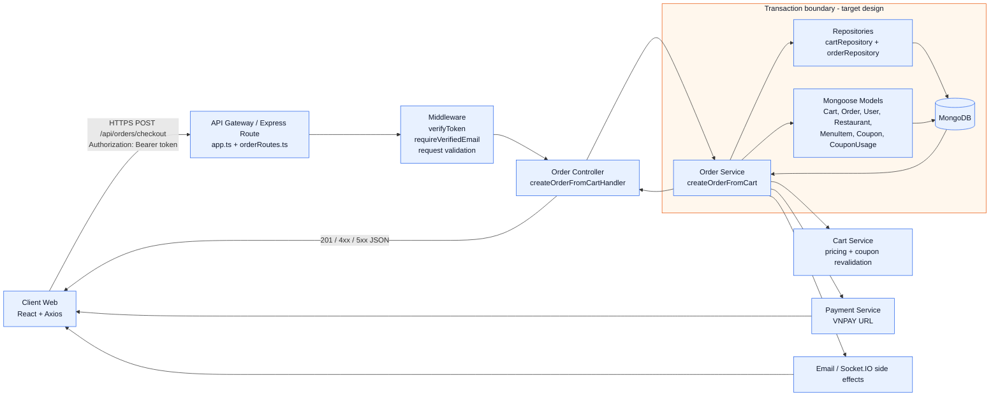

# 3.3.1. Kiến trúc và logic xử lý tạo đơn hàng

> **Phạm vi khảo sát:** Báo cáo được xây dựng từ `server/src/routes/`, `controllers/`, `services/`, `repositories/`, `models/` và các type liên quan. Repository sử dụng Express, TypeScript và Mongoose/MongoDB. Không tìm thấy `style_guide.md` trong repository; nội dung giữ quy ước tiếng Việt và cấu trúc báo cáo hiện có.
>
> **Lưu ý về hiện trạng:** Endpoint tạo đơn đang được triển khai là `POST /api/orders/checkout`. Luồng hiện tại đọc `Cart`, dựng snapshot rồi lưu `Order` và xóa giỏ bằng hai thao tác riêng; chưa có `mongoose.startSession()`/`withTransaction()`, trường tồn kho trong `MenuItem`, bước kiểm tra trạng thái nhà hàng trong `createOrderFromCart`, hoặc header idempotency được xử lý ở route này. Các sơ đồ và mã giả bên dưới phân biệt rõ **hiện trạng** với **luồng mục tiêu đề xuất**.

## 1. Khái niệm & Đặt vấn đề

Tạo đơn hàng là điểm hội tụ của nhiều quy tắc nghiệp vụ: giỏ hàng phải còn món, món phải thuộc cùng nhà hàng, nhà hàng phải sẵn sàng phục vụ, giá phải được chốt lại từ dữ liệu tin cậy, voucher phải còn hiệu lực và tổng tiền phải bao gồm phí giao hàng. Kết quả cuối cùng phải tạo được một chứng từ đơn hàng bất biến, đồng thời loại bỏ hoặc khóa giỏ hàng đã chuyển đổi.

Nếu các bước trên được thực hiện bằng nhiều truy vấn độc lập, hệ thống có thể gặp các rủi ro sau:

- **Race-condition tồn kho:** hai request cùng đọc một món còn đủ số lượng rồi cùng tạo đơn, dẫn đến bán vượt tồn kho. Hiện `MenuItem` chỉ có `isAvailable`, `soldCount` và không có trường `stock`.
- **Race-condition giỏ hàng:** hai request checkout đồng thời cùng đọc một `Cart`, cùng tạo `Order` và cùng xóa giỏ. Không có transaction xuyên document để bảo đảm chỉ một kết quả được commit.
- **Sai lệch giá:** giá trong giỏ được chụp tại thời điểm thêm món; nếu giá menu thay đổi, checkout phải có chính sách rõ ràng về việc dùng giá giỏ hay tái định giá từ menu. Không được tin tổng tiền do client gửi.
- **Lạm dụng voucher:** chỉ kiểm tra trạng thái, thời gian hiệu lực và `minOrderAmount` là chưa đủ nếu voucher có giới hạn số lần dùng theo khách hàng hoặc toàn hệ thống. Việc ghi nhận `CouponUsage` cần nằm cùng transaction và có unique constraint phù hợp.
- **Đặt trùng:** retry do timeout mạng hoặc người dùng nhấn nút nhiều lần có thể sinh nhiều đơn nếu không có idempotency key ổn định.

Mục tiêu của kiến trúc là đặt toàn bộ quyết định nghiệp vụ quan trọng ở backend, thực hiện các thay đổi liên quan trong một transaction MongoDB khi môi trường triển khai hỗ trợ replica set, và trả về lỗi có thể phân loại để client retry an toàn.

## 2. Giải pháp & Hiện thực

### 2.1. Kiến trúc phân tầng mức cao

Ứng dụng hiện dùng Express route thay cho một API Gateway độc lập. Vì vậy, khối **API Gateway/Route** trong sơ đồ đại diện cho lớp HTTP routing, middleware xác thực và validation của Express. Repository là lớp truy cập dữ liệu Mongoose; không có Prisma trong codebase.



**Hình 3.3a: Kiến trúc phân tầng xử lý tạo đơn hàng**

Vai trò chính của từng tầng:

| Tầng | Thành phần thực tế | Trách nhiệm |
| --- | --- | --- |
| Client | `client/src/services/orderService.ts` | Gửi payload checkout, nhận mã đơn và `paymentUrl`. |
| API Gateway/Route | `app.ts`, `orderRoutes.ts` | Mount `/api/orders`, áp dụng `verifyToken`, định tuyến `/checkout`. |
| Middleware | `authMiddleware.ts`, `validateMiddleware.ts` | Xác thực JWT, kiểm tra trạng thái tài khoản và email. Payload checkout hiện chưa gắn Zod schema riêng. |
| Controller | `orderController.ts` | Kiểm tra tối thiểu payload, gọi service, chuyển lỗi sang error handler. |
| Service | `orderService.ts`, `cartService.ts` | Điều phối nghiệp vụ, dựng snapshot, tính giá, kiểm tra coupon và tạo đơn. |
| Repository/Model | `cartRepository.ts`, `orderRepository.ts`, Mongoose models | Truy vấn và ghi `Cart`, `Order` cùng các document liên quan. |
| Database | MongoDB | Lưu document, unique index và validation schema. |
| Side effect | `paymentService.ts`, `emailService.ts`, `socketService.ts` | Tạo URL thanh toán, gửi email và phát sự kiện; không nên đặt các side effect ngoài database vào transaction. |

### 2.2. Sequence Diagram: luồng giao dịch tạo đơn

Sơ đồ sau là **luồng mục tiêu** cần dùng khi bổ sung transaction, tồn kho và idempotency. Các bước được đánh dấu `Hiện trạng: chưa có` phản ánh đúng code hiện tại, không phải khẳng định hệ thống đã thực thi chúng.

**Hình 3.3: Biểu đồ tuần tự luồng xử lý giao dịch tạo đơn hàng**

```mermaid
sequenceDiagram
    autonumber
    actor Customer as Khách hàng
    participant Client as Client Web
    participant Route as Express Route / Middleware
    participant Controller as OrderController
    participant Service as OrderService
    participant DB as MongoDB Transaction
    participant Cart as Cart
    participant User as User
    participant Restaurant as Restaurant
    participant Menu as MenuItem
    participant Coupon as Coupon / CouponUsage
    participant Order as Order
    participant Payment as PaymentService

    Customer->>Client: Xác nhận checkout
    Client->>Route: POST /api/orders/checkout\nAuthorization: Bearer token\nIdempotency-Key: <khuyến nghị>
    Route->>Route: verifyToken + requireVerifiedEmail
    alt Token thiếu/hết hạn
        Route-->>Client: 401 Unauthorized
    else Email chưa xác minh
        Route-->>Client: 403 Forbidden
    else Hợp lệ
        Route->>Controller: createOrderFromCartHandler(req)
        Controller->>Service: createOrderFromCart(userId, payload)
        Service->>DB: startSession(); startTransaction()

        DB->>DB: Kiểm tra Idempotency-Key theo customerId
        alt Key đã hoàn tất
            DB-->>Service: Trả lại order đã tạo trước đó
            Service->>DB: commitTransaction()
            Service-->>Controller: Kết quả idempotent
        else Key mới
            DB->>Cart: Đọc Cart của customer
            Cart-->>DB: items, giá đã lưu, couponId, restaurantId
            alt Cart rỗng hoặc không tồn tại
                DB-->>Service: Abort: CART_EMPTY
            else Cart hợp lệ
                DB->>Restaurant: Đọc trạng thái nhà hàng và phí giao hàng
                alt Nhà hàng không open/approved
                    DB-->>Service: Abort: RESTAURANT_UNAVAILABLE
                else Nhà hàng sẵn sàng
                    DB->>Menu: Đọc và khóa logic các MenuItem trong cart
                    Menu->>Menu: Kiểm tra isAvailable, deletedAt,\nthuộc đúng restaurant và stock >= quantity
                    alt Món không tồn tại / hết hàng / thiếu tồn kho
                        DB-->>Service: Abort: ITEM_UNAVAILABLE
                    else Món hợp lệ
                        DB->>Coupon: Đọc coupon và kiểm tra status,\nstartsAt/endsAt, minOrderAmount, giới hạn sử dụng
                        alt Coupon không hợp lệ
                            DB-->>Service: Abort: INVALID_COUPON
                        else Coupon hợp lệ hoặc không dùng coupon
                            Service->>Service: Tính subtotal từ dữ liệu server
                            Service->>Service: Tính discount + deliveryFee + grandTotal
                            Service->>Order: Tạo Order snapshot + statusHistory
                            DB->>Menu: Atomic decrement stock\n(hoặc cập nhật reservation)
                            DB->>Coupon: Ghi CouponUsage nếu có coupon
                            DB->>Cart: Xóa hoặc đánh dấu Cart đã chuyển đổi
                            DB->>DB: commitTransaction()
                            DB-->>Service: Commit thành công
                            Service->>Payment: Tạo payment URL nếu VNPAY
                            Service-->>Controller: order + paymentUrl
                        end
                    end
                end
            end
        end
        Controller-->>Client: 201 Created
    end

    Note over Service,DB: Hiện trạng: code chưa start transaction,\nchưa có stock và chưa ghi CouponUsage trong checkout.
    Note over Payment,Client: Email/socket nên chạy sau commit,\nkhông làm rollback database nếu side effect thất bại.
```

#### Đối chiếu với code hiện tại

`createOrderFromCart` hiện thực các bước đọc cart, user và dữ liệu nhà hàng đã populate; dựng `customerSnapshot`, `restaurantSnapshot`, `couponSnapshot`, `items` và `pricing`; sau đó gọi `new Order(...).save()` rồi `cartService.clearCart(userId)`. Các điểm chưa có:

1. Không có `startSession()` hoặc `withTransaction()`.
2. `MenuItem` không có `stock`/`inventoryQuantity`; chỉ kiểm tra khả dụng ở một số luồng thêm món và reorder.
3. `createOrderFromCart` không kiểm tra lại `Restaurant.approvalStatus` và `operationStatus`.
4. Checkout không tái xác thực coupon từ `couponId` nếu cart đã chứa coupon được populate; việc kiểm tra coupon chủ yếu xảy ra khi áp coupon vào cart.
5. Không tạo `CouponUsage` trong luồng checkout.
6. Không nhận hoặc xử lý `Idempotency-Key`; `checkoutKey` hiện được sinh mới bằng `ObjectId` cho mỗi request, nên không chống retry trùng.

### 2.3. Đặc tả API Endpoint

#### Endpoint thực tế: `POST /api/orders/checkout`

| Thành phần | Đặc tả |
| --- | --- |
| Method | `POST` |
| URL | `/api/orders/checkout` |
| Authentication | Bắt buộc JWT Bearer token qua header `Authorization`. |
| Authorization/business gate | Tài khoản không bị khóa và email phải đã xác minh qua `requireVerifiedEmail`. |
| Recommended header | `Idempotency-Key: <chuỗi duy nhất cho một lần checkout>`; hiện route chưa xử lý header này. |
| Content-Type | `application/json` |

**Request header**

```http
Authorization: Bearer <access-token>
Content-Type: application/json
Idempotency-Key: checkout-20261007-<client-generated-uuid>
```

**Request body hiện tại**

```json
{
  "paymentMethod": "COD",
  "deliveryAddress": {
    "recipientName": "Nguyen Van A",
    "phone": "0900000000",
    "line1": "123 Nguyen Trai",
    "ward": "Ward 5",
    "district": "District 1",
    "city": "Ho Chi Minh City"
  },
  "note": "Giao trong giờ hành chính"
}
```

| Trường | Kiểu | Bắt buộc | Mô tả |
| --- | --- | --- | --- |
| `paymentMethod` | `string` | Có | Client type cho phép `COD`, `VNPAY`, `MOMO`; service lưu dạng chữ thường. Model cũng khai báo `stripe`, `mock`, nhưng payload checkout hiện không khai báo các giá trị này ở type client. |
| `deliveryAddress` | `object` | Có | Địa chỉ nhận hàng. Controller chỉ kiểm tra object tồn tại; nên bổ sung schema validation cho từng trường. |
| `deliveryAddress.recipientName` | `string` | Có theo contract type | Tên người nhận. |
| `deliveryAddress.phone` | `string` | Có theo contract type | Số điện thoại người nhận. |
| `deliveryAddress.line1` | `string` | Có theo contract type | Địa chỉ chi tiết. |
| `deliveryAddress.ward` | `string` | Có theo contract type | Phường/xã. |
| `deliveryAddress.district` | `string` | Có theo contract type | Quận/huyện. |
| `deliveryAddress.city` | `string` | Có theo contract type | Tỉnh/thành phố. |
| `note` | `string` | Không | Ghi chú giao hàng. |

**Response thành công `201 Created`**

```json
{
  "message": "Đơn hàng đã được tạo thành công.",
  "order": {
    "_id": "671234567890abcdef123456",
    "orderNumber": "FD-123456-ABC123"
  },
  "paymentUrl": "https://sandbox.vnpayment.vn/..."
}
```

`paymentUrl` chỉ xuất hiện khi phương thức thanh toán cần chuyển hướng, điển hình là `VNPAY`.

**Các status code**

| Status | Tình huống |
| --- | --- |
| `201` | Tạo đơn thành công. |
| `400` | Thiếu cart, cart rỗng, payload thiếu `deliveryAddress`/`paymentMethod`, ObjectId hoặc dữ liệu nghiệp vụ không hợp lệ. |
| `401` | Thiếu hoặc sai Bearer token; tài khoản không còn hợp lệ. |
| `403` | Email chưa xác minh. |
| `409` | Khuyến nghị dùng cho idempotency conflict, coupon usage conflict hoặc tồn kho vừa bị request khác giữ hết; error handler hiện đã ánh xạ duplicate key sang `409`. |
| `500` | Lỗi không mong muốn, lỗi database hoặc thông tin nhà hàng trong cart không hợp lệ. |

Nếu tài liệu bên ngoài yêu cầu tên `POST /api/orders`, cần ghi rõ đó là tên rút gọn của resource; route thực tế của codebase phải là `POST /api/orders/checkout`.

### 2.4. Mã giả transaction cốt lõi

Đây là mã giả đề xuất cho MongoDB/Mongoose. Nó không phải đoạn code đã tồn tại trong repository; mục tiêu là chỉ ra ranh giới rollback cần bổ sung.

```ts
async function createOrderFromCart(userId, payload, idempotencyKey) {
  const session = await mongoose.startSession()

  try {
    let result

    await session.withTransaction(async () => {
      const previous = await Order.findOne({
        customerId: userId,
        idempotencyKey,
      }).session(session)

      if (previous) {
        result = toCheckoutResponse(previous)
        return
      }

      const cart = await Cart.findOne({ userId }).session(session)
      assertCartIsNotEmpty(cart)

      const restaurant = await Restaurant.findOne({
        _id: cart.restaurantId,
        approvalStatus: 'approved',
        operationStatus: 'open',
      }).session(session)
      assertRestaurantIsAvailable(restaurant)

      const itemIds = cart.items.map((item) => item.menuItemId)
      const menuItems = await MenuItem.find({
        _id: { $in: itemIds },
        restaurantId: restaurant._id,
        isAvailable: true,
        deletedAt: null,
      }).session(session)
      assertEveryCartItemIsAvailable(cart.items, menuItems)

      const coupon = cart.couponId
        ? await Coupon.findOne({
            _id: cart.couponId,
            status: 'active',
            startsAt: { $lte: new Date() },
            endsAt: { $gte: new Date() },
          }).session(session)
        : null
      assertCouponCanBeUsed(coupon, cart, userId)

      const pricing = calculateServerSidePricing({
        cart,
        menuItems,
        coupon,
        deliveryFee: restaurant.delivery.fee,
      })

      // Atomic condition: chỉ trừ khi stock hiện tại vẫn đủ.
      for (const item of cart.items) {
        const updated = await MenuItem.updateOne(
          { _id: item.menuItemId, stock: { $gte: item.quantity } },
          { $inc: { stock: -item.quantity, soldCount: item.quantity } },
          { session },
        )
        if (updated.modifiedCount !== 1) {
          throw new ConflictError('ITEM_OUT_OF_STOCK')
        }
      }

      const order = await Order.create([buildOrderSnapshot({
        userId,
        cart,
        restaurant,
        menuItems,
        coupon,
        pricing,
        idempotencyKey,
      })], { session })

      if (coupon) {
        await CouponUsage.create([{
          couponId: coupon._id,
          customerId: userId,
          orderId: order[0]._id,
          status: 'applied',
        }], { session })
      }

      await Cart.deleteOne({ _id: cart._id, userId }, { session })
      result = toCheckoutResponse(order[0])
    })

    // Chỉ thực hiện sau commit; lỗi email/payment không rollback Order.
    await enqueuePostCommitSideEffects(result)
    return result
  } finally {
    await session.endSession()
  }
}
```

Khi bất kỳ bước nào ném lỗi, `withTransaction` abort transaction: `Order` chưa commit sẽ bị hủy, các lần `$inc` tồn kho trong transaction bị hoàn tác, `CouponUsage` không được ghi và `Cart` vẫn còn nguyên. Nếu lỗi xảy ra sau commit ở email, Socket.IO hoặc tạo URL thanh toán, database không rollback; hệ thống cần retry/outbox cho side effect thay vì tạo lại đơn.

## 3. Đánh giá & Kết quả

### 3.1. Mục tiêu thời gian phản hồi

Mục tiêu thiết kế cho `POST /api/orders/checkout` là **p95 dưới 200 ms** trong điều kiện database ổn định, cart nhỏ và không tính thời gian người dùng hoàn tất cổng thanh toán bên ngoài. Đây là target, không phải số đo đã được benchmark trong repository.

Các yếu tố ảnh hưởng latency:

- Số lần đọc `Cart`, `User`, `Restaurant`, `MenuItem` và `Coupon`.
- Transaction và lock/validation tồn kho.
- Index trên `Cart.userId`, `Order.customerId + checkoutKey`, `Coupon.code` và các khóa tham chiếu.
- Không chờ email hoặc Socket.IO trong request path.
- VNPAY chỉ nên trả URL nhanh; không chờ callback thanh toán.

Để xác nhận target, cần đo p50/p95/p99 bằng tải đại diện, theo dõi thời gian transaction và tách thời gian database khỏi thời gian side effect.

### 3.2. Bảo toàn tính toàn vẹn và ACID

| Thuộc tính | Cách bảo đảm đề xuất | Hiện trạng |
| --- | --- | --- |
| Atomicity | Một transaction cho tạo Order, trừ stock, ghi CouponUsage và xóa Cart. | Chưa có; `Order.save()` và `clearCart()` là hai thao tác tách rời. |
| Consistency | Schema validation, enum, điều kiện stock, trạng thái nhà hàng, tính giá server-side và unique index. | Có validation một phần; chưa có stock và kiểm tra nhà hàng trong create order. |
| Isolation | Transaction MongoDB, atomic conditional update và idempotency key. | Chưa có locking/optimistic version check tường minh. |
| Durability | MongoDB commit và write concern phù hợp production. | Phụ thuộc cấu hình MongoDB hiện tại; `database.ts` chỉ gọi `mongoose.connect`. |

Transaction MongoDB yêu cầu deployment hỗ trợ replica set hoặc sharded cluster. Nếu môi trường local chỉ là standalone MongoDB, cần bật replica set trước khi bật luồng transaction production.

### 3.3. Khả năng chịu tải

Kiến trúc stateless ở tầng Express cho phép scale ngang API server; session đăng nhập nằm trong JWT và side effect realtime dùng Socket.IO. Database sẽ là nút thắt chính khi đồng thời có nhiều checkout:

- Dùng compound/unique index và tránh truy vấn không có điều kiện khóa.
- Đọc nhiều `MenuItem` bằng một truy vấn `$in`, không đọc tuần tự từng món.
- Dùng atomic stock decrement thay vì đọc rồi ghi lại giá trị tồn kho.
- Đẩy email, cập nhật recommendation và thông báo realtime sang job/outbox sau commit.
- Giới hạn retry transaction và dùng backoff để tránh khuếch đại tải khi tranh chấp.
- Theo dõi connection pool, transaction abort rate, duplicate-key rate, lock wait và p95 latency.

### 3.4. Chống đặt trùng bằng Idempotency Key

`checkoutKey` hiện tại được sinh mới bằng `new Types.ObjectId().toString()` trong mỗi request, nên không phải idempotency key do client giữ ổn định. Cơ chế đề xuất:

1. Client tạo UUID cho một lần người dùng bấm đặt hàng và gửi qua `Idempotency-Key`.
2. Backend lưu key cùng `customerId`, request fingerprint và kết quả `orderId`.
3. Đặt unique index trên `{ customerId: 1, idempotencyKey: 1 }`.
4. Nếu request lặp với cùng key và cùng payload, trả lại kết quả đơn trước đó.
5. Nếu cùng key nhưng payload khác, trả `409 Idempotency key reuse with different payload`.
6. Chỉ lưu kết quả idempotency trong cùng transaction với `Order`; không dùng key mới khi retry do timeout.

Kết luận, luồng hiện tại đã có phân tầng controller–service–repository/model và snapshot giá trị đơn hàng, nhưng để đạt mục tiêu tính tiền chính xác, chống race-condition và đáp ứng yêu cầu ACID cần bổ sung transaction, kiểm tra nhà hàng/tồn kho tại checkout, ghi nhận sử dụng voucher và idempotency key. 
