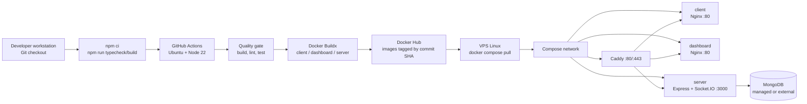

# 4.1–4.2. Chuẩn hóa môi trường và thiết lập triển khai

## 1. Khái niệm và đặt vấn đề

### 1.1. Tầm quan trọng của môi trường có khả năng tái lập

Hệ thống MămMăm Food Ordering được tổ chức dưới dạng monorepo gồm giao diện khách hàng, dashboard vận hành và API server. Mỗi thành phần có tập dependency, port và biến môi trường riêng, nhưng được quản lý tập trung bằng npm workspaces. Nếu các phiên bản runtime, dependency hoặc cấu hình kết nối không được chuẩn hóa, hệ thống dễ phát sinh lỗi “chạy được ở máy tôi” (works on my machine), sai khác giữa môi trường phát triển, CI và VPS.

Việc cố định dependency trong `package-lock.json`, mô tả Node.js trong `engines`, sử dụng Docker multi-stage build và triển khai bằng Docker Compose giúp giảm sai lệch môi trường. CI trên `ubuntu-latest` kiểm tra build, lint và test trước khi publish ba image ứng dụng lên Docker Hub. Caddy đứng trước các service để định tuyến domain, API và Socket.IO, đồng thời tự động xử lý HTTPS khi DNS đã trỏ đúng về VPS.

### 1.2. Phạm vi và căn cứ khảo sát

Thông số dưới đây được trích xuất từ `package.json`, `package-lock.json`, `Dockerfile` trong thư mục `docker/`, `compose.yaml`, các file `.env.example`, `README.md`, `deploy/`, `run.sh` và workflow `.github/workflows/ci-dockerhub.yml`. Những thông tin không được repository khai báo được đánh dấu rõ là **chưa xác định** hoặc **khuyến nghị vận hành**, không được xem là phiên bản thực tế của dự án.

## 2. Hiện thực và hướng dẫn chi tiết

### 2.1. Thành phần phần mềm và phiên bản thực tế

**Bảng 4.1: Thông số phần mềm được xác định từ repository**

| Yêu cầu / Công cụ | Phiên bản hoặc trạng thái thực tế | Mục đích sử dụng |
| --- | --- | --- |
| Node.js local | `20.19+` hoặc `22.12+` theo root `package.json` | Runtime cho monorepo |
| Node.js CI/Docker | Node.js `22`; image `node:22-alpine` cho frontend và `node:22-bookworm-slim` cho server | Build và chạy production |
| npm | `10+` theo `README.md`; lockfile dùng `lockfileVersion: 3` | Quản lý dependency và workspaces |
| TypeScript | Root `5.7.3`; server/client khai báo `^7.0.2`; client-dashboard khai báo `~5.7.2`; lockfile thực tế có `7.0.2` | Type checking và biên dịch |
| Frontend customer | React `19.2.8`, Vite `8.2.0`, React Router DOM `7.2.0` | Giao diện khách hàng |
| Frontend dashboard | React `19.0.0` theo manifest, Vite `6.1.0`, React Router `7.1.5` | Dashboard Owner/Admin |
| Backend framework | Express `5.2.1`; **không dùng NestJS** | HTTP API và middleware |
| ODM / database client | Mongoose `9.9.1` | Kết nối MongoDB và ánh xạ model |
| Database server | MongoDB; URI mẫu `mongodb://127.0.0.1:27017`; **version server chưa được khai báo** | Lưu người dùng, nhà hàng, menu, giỏ hàng và đơn hàng |
| Realtime | Socket.IO server/client `4.8.3` | Xác thực socket và cập nhật realtime theo room đơn hàng |
| Reverse proxy | Caddy `2.10-alpine` | TLS, định tuyến frontend, `/api` và `/socket.io` |
| Static web server | Nginx `1.29-alpine` | Phục vụ bundle frontend trong runtime image |
| Container orchestration | Docker Compose Specification qua `compose.yaml`; **Docker Engine/Compose CLI version chưa pin** | Chạy client, dashboard, server và Caddy |
| CI/CD | GitHub Actions trên `ubuntu-latest`, setup Node action dùng Node `22`, Docker Buildx | Build, kiểm thử và publish image |
| OS khuyến nghị | CI dùng Ubuntu; production nên dùng Linux server tương thích Docker; **không có bản phân phối bắt buộc trong repo** | Môi trường chạy Docker ổn định |
| PostgreSQL / Redis | **Không được cấu hình**; không có `DATABASE_URL` hoặc `REDIS_URL` | Không thuộc kiến trúc hiện tại |

Các version có hậu tố `^` hoặc `~` là khoảng version trong manifest; version lockfile là căn cứ cho dependency được cài khi chạy `npm ci`. MongoDB server, Docker Engine và Docker Compose không có file pin version trong repository, do đó cần kiểm tra và quản lý ở tầng hạ tầng khi triển khai.

### 2.2. Cấu hình phần cứng

Repository không khai báo quota CPU, RAM hoặc dung lượng đĩa. Bảng sau là mức sizing vận hành khuyến nghị cho một VPS nhỏ chạy ba image ứng dụng, Caddy và kết nối tới MongoDB bên ngoài; đây là tiêu chuẩn triển khai đề xuất, không phải thông số hard requirement được sinh ra từ mã nguồn.

**Bảng 4.2: Cấu hình phần cứng tối thiểu và khuyến nghị**

| Tài nguyên | Tối thiểu để thử nghiệm / tải thấp | Khuyến nghị cho demo hoặc production nhỏ | Cơ sở sử dụng |
| --- | --- | --- | --- |
| CPU | 2 vCPU | 4 vCPU | Build image, Node.js API, Caddy và hai frontend |
| RAM | 2 GB | 4 GB trở lên | Container runtime, cache build và tiến trình API |
| Disk | 20 GB SSD | 40 GB SSD trở lên | Image, log Docker, Caddy certificate và dữ liệu tạm |
| Network | 1 Mbps ổn định | 5 Mbps trở lên, mở TCP `80/443` | Pull image, HTTPS, API và Socket.IO |
| Database | MongoDB local hoặc managed | MongoDB managed có backup và monitoring | Dữ liệu nghiệp vụ không được lưu trong container ứng dụng |

### 2.3. Sơ đồ cấu trúc cây thư mục

Cây dưới đây tập trung vào các thành phần có ý nghĩa đối với triển khai và nghiệp vụ; các thư mục test, asset và file cấu hình phụ trợ không được liệt kê hết.

```text
.
├── package.json                         # npm workspaces và lệnh dùng chung
├── package-lock.json                    # dependency graph tái lập
├── compose.yaml                         # production Compose: client, dashboard, server, Caddy
├── docker/
│   ├── client.Dockerfile                # build React customer -> Nginx
│   ├── dashboard.Dockerfile             # build dashboard -> Nginx
│   ├── server.Dockerfile                # build Express API -> Node runtime
│   └── nginx-spa.conf                   # SPA fallback và healthz
├── deploy/
│   ├── Caddyfile                        # reverse proxy domain/API/Socket.IO
│   ├── deploy.env.example               # domain, Docker Hub, release tag
│   └── server.env.example               # biến môi trường production của API
├── client/
│   ├── src/
│   │   ├── components/cart/             # MiniCart và UI giỏ hàng
│   │   ├── contexts/CartContext.tsx     # state giỏ hàng phía customer
│   │   ├── pages/                       # cart, checkout, order, payment
│   │   ├── services/                    # cartService, orderService, socketService
│   │   └── routes/                      # routing customer
│   └── vite.config.ts                   # port 5173 và proxy /api
├── client-dashboard/
│   ├── src/
│   │   ├── app/                         # providers, auth và route guards
│   │   ├── pages/                       # owner/admin pages
│   │   └── components/                  # dashboard UI và biểu đồ
│   └── vite.config.ts                   # port 5174 và proxy /api
├── server/
│   ├── src/
│   │   ├── config/
│   │   │   ├── env.ts                   # Zod schema và fail-fast production
│   │   │   └── database.ts              # Mongoose connection
│   │   ├── models/                      # User, Restaurant, Cart, Order, MenuItem...
│   │   ├── repositories/                # cartRepository, orderRepository
│   │   ├── services/                    # nghiệp vụ auth, cart, order, payment...
│   │   ├── controllers/                 # HTTP controller
│   │   ├── routes/                      # auth, cart, order, owner, admin...
│   │   ├── socket.ts                    # Socket.IO gateway, auth và order rooms
│   │   └── index.ts                     # khởi động API, DB và socket
│   └── .env.example                     # cấu hình local API
├── .github/workflows/
│   └── ci-dockerhub.yml                 # quality gate và publish images
├── scripts/                             # không có trong repository hiện tại
└── migrations/                          # không có migration framework/thư mục riêng
```

Trong kiến trúc hiện tại, “database migrations” không phải là một module độc lập. Schema được định nghĩa bởi các Mongoose model và database được kết nối qua `server/src/config/database.ts`. Vì vậy, bước migration phải được ghi nhận là **không áp dụng**; nếu cần thay đổi dữ liệu production, cần bổ sung một migration/seed tool có kiểm soát trước khi tự động hóa.

### 2.4. Từ điển biến môi trường

**Bảng 4.3: Các biến môi trường quan trọng**

| Biến | Phạm vi | Ý nghĩa | Giá trị mẫu an toàn |
| --- | --- | --- | --- |
| `NODE_ENV` | Server | Chế độ chạy và guard secret | `development` hoặc `production` |
| `PORT` | Server | Port Express nội bộ | `3000` |
| `MONGODB_URI` | Server | MongoDB connection string | `mongodb://127.0.0.1:27017` (local); production dùng secret manager |
| `MONGODB_DB_NAME` | Server | Tên database nghiệp vụ | `food_ordering` |
| `CLIENT_ORIGIN` | Server | Origin chính cho CORS/redirect | `http://localhost:5173` |
| `CLIENT_ORIGINS` | Server | Danh sách origin, phân tách bằng dấu phẩy | `http://localhost:5173,http://localhost:5174` |
| `CLIENT_URL` | Server | URL customer dùng trong email/payment redirect | `http://localhost:5173` |
| `JWT_SECRET` | Server | Ký access token | `generate-random-secret-not-committed` |
| `JWT_REFRESH_SECRET` | Server | Ký refresh token | `generate-another-random-secret` |
| `JWT_EXPIRES_IN` | Server | Thời hạn access token | `15m` |
| `JWT_REFRESH_EXPIRES_IN` | Server | Thời hạn refresh token | `7d` |
| `VNPAY_MODE` | Server | Chế độ thanh toán | `mock` cho kiểm thử, `real` khi đã cấu hình |
| `VNP_TMNCODE` / `VNP_HASHSECRET` | Server | Thông tin xác thực VNPAY | Placeholder local; secret thật chỉ lưu trong secret manager |
| `VNP_URL` | Server | Endpoint VNPAY | `https://sandbox.vnpayment.vn/paymentv2/vpcpay.html` |
| `VNP_RETURN_URL` | Server | URL callback payment | `http://localhost:5173/payment/success` |
| `VNPAY_PAYMENT_TIMEOUT_MINUTES` | Server | Thời gian tự hủy đơn chưa thanh toán | `30` |
| `SMTP_HOST` / `SMTP_PORT` | Server | SMTP gửi email | `sandbox.smtp.mailtrap.io` / `2525` |
| `SMTP_USER` / `SMTP_PASS` | Server | Credential SMTP | Placeholder, không commit giá trị thật |
| `SMTP_SECURE` | Server | TLS trực tiếp cho SMTP | `false` với port `2525` |
| `VITE_API_BASE_URL` | Frontend | Base URL API | `/api` khi dùng Vite/Caddy proxy |
| `VITE_SOCKET_URL` | Customer build | Socket.IO origin tùy chọn | Để trống khi socket dùng cùng origin |
| `DOCKERHUB_USERNAME` | Deploy | Docker Hub namespace | `your-dockerhub-username` |
| `DOCKERHUB_REPOSITORY` | Deploy | Tên repository image | `fsa-food-ordering` |
| `RELEASE_TAG` | Deploy | Tag release hoặc commit SHA | `latest` hoặc SHA cụ thể |
| `SERVER_ENV_FILE` | Compose | Đường dẫn env server | `./deploy/server.env` |
| `CUSTOMER_DOMAIN` / `DASHBOARD_DOMAIN` | Compose | Domain Caddy | `food.example.com` / `admin.food.example.com` |
| `DATABASE_URL` / `REDIS_URL` | — | Không được ứng dụng đọc | **Không cấu hình; không tự thêm** |

Các secret như JWT, VNPAY, SMTP và credential MongoDB không được commit. `server/src/config/env.ts` thực hiện validate bằng Zod và fail-fast trong production nếu vẫn dùng giá trị dev mặc định cho các secret bắt buộc.

### 2.5. Quy trình thiết lập từng bước

#### Bước 1: Clone repository và cài dependency

```bash
git clone https://github.com/czx04/fsa-fe-food-ordering.git
cd fsa-fe-food-ordering
node --version
npm --version
npm ci
```

Trên Windows PowerShell có thể dùng:

```powershell
git clone https://github.com/czx04/fsa-fe-food-ordering.git
Set-Location fsa-fe-food-ordering
node --version
npm --version
npm ci
```

`npm ci` phải được chạy từ thư mục gốc để cài toàn bộ npm workspaces theo lockfile.

#### Bước 2: Khởi tạo cấu hình biến môi trường

```bash
cp server/.env.example server/.env
cp client/.env.example client/.env
cp client-dashboard/.env.example client-dashboard/.env
```

```powershell
Copy-Item server/.env.example server/.env
Copy-Item client/.env.example client/.env
Copy-Item client-dashboard/.env.example client-dashboard/.env
```

Tối thiểu cần kiểm tra `MONGODB_URI`, `MONGODB_DB_NAME`, `JWT_SECRET`, `JWT_REFRESH_SECRET`, `CLIENT_ORIGINS` và các biến tích hợp VNPAY/SMTP nếu chạy chức năng thật. Không đưa các file `.env` thực tế vào Git.

#### Bước 3: Cơ sở dữ liệu và migration

Hiện tại repository không có lệnh `migration`, thư mục `migrations/` hoặc công cụ migration MongoDB. Vì vậy, không chạy một lệnh migration giả định. Hãy khởi động MongoDB, đặt `MONGODB_URI` và để API tạo/sử dụng collection theo Mongoose model:

```bash
# Kiểm tra MongoDB local đang lắng nghe cổng mặc định
mongosh "mongodb://127.0.0.1:27017/food_ordering"

# Không có migration command trong repository hiện tại.
# Nếu cần seed, chỉ chạy script seed đã được nhóm phát triển phê duyệt.
```

Trong production, sử dụng backup/snapshot và quy trình migration riêng trước khi thay đổi schema hoặc dữ liệu. Không xóa dữ liệu bằng seed script nếu chưa có xác nhận phá hủy dữ liệu theo cơ chế `CONFIRM_DESTRUCTIVE_SEED` được mô tả trong file mẫu.

#### Bước 4: Chạy chế độ phát triển

```bash
npm run dev
```

Các service mặc định:

```text
Customer web:       http://localhost:5173
Owner/Admin:        http://localhost:5174
API health check:   http://localhost:3000/api/health
```

Có thể chạy riêng API hoặc từng frontend:

```bash
npm run dev:server
npm run dev:customer
npm run dev:dashboard
```

#### Bước 5: Build và triển khai bằng Docker Compose

CI build ba image từ các Dockerfile riêng, sau đó push theo tag `client-<commit-sha>`, `dashboard-<commit-sha>` và `server-<commit-sha>`. Trên VPS, khởi tạo cấu hình deploy:

```bash
cp deploy/deploy.env.example deploy/deploy.env
cp deploy/server.env.example deploy/server.env
```

Điền domain, Docker Hub namespace, `RELEASE_TAG` và secret production. Sau đó pull và dựng service:

```bash
docker compose --env-file deploy/deploy.env pull
docker compose --env-file deploy/deploy.env up -d
docker compose --env-file deploy/deploy.env ps
```

Nếu cần kiểm tra build image tại máy lập trình viên:

```bash
docker build -f docker/client.Dockerfile -t fsa-client:local .
docker build -f docker/dashboard.Dockerfile -t fsa-dashboard:local .
docker build -f docker/server.Dockerfile -t fsa-server:local .
```

Image frontend dùng Node ở build stage và Nginx ở runtime stage. Image server dùng Node `22-bookworm-slim`, chạy `node dist/index.js` bằng user không có quyền root. Caddy chỉ khởi động sau khi healthcheck của client, dashboard và server thành công.

Quy trình từ mã nguồn đến service được mô tả trong sơ đồ sau.



<div align="center"><strong><em>Hình 4.1: Sơ đồ quy trình thiết lập và triển khai hệ sinh thái dịch vụ</em></strong></div>

## 3. Đánh giá và rủi ro vận hành

### 3.1. Đánh giá giải pháp Docker

Docker cung cấp ranh giới runtime rõ ràng cho từng service: frontend được đóng gói thành static asset với Nginx, API có Node runtime riêng và Caddy đảm nhiệm ingress. Multi-stage build làm giảm thành phần không cần thiết trong image runtime; healthcheck và `depends_on.condition` giúp hạn chế việc Caddy nhận traffic trước khi backend sẵn sàng. Tag image theo commit SHA hỗ trợ rollback bằng cách đổi `RELEASE_TAG`, đồng thời Compose giữ cấu hình service nhất quán giữa các lần triển khai.

Hạn chế chính là repository chưa pin Docker Engine/Compose CLI, MongoDB server và image digest. Vì vậy, kết quả vẫn có thể thay đổi nếu registry cập nhật mutable tag hoặc VPS dùng phiên bản Docker khác. Production nên pin image digest, dùng release tag bất biến, giới hạn quyền Docker socket và theo dõi log/healthcheck tập trung.

### 3.2. Rủi ro biến môi trường và phương án quản lý

| Rủi ro | Tác động | Biện pháp kiểm soát |
| --- | --- | --- |
| Commit JWT, SMTP, VNPAY hoặc MongoDB credential | Chiếm quyền xác thực, gửi mail trái phép hoặc truy cập dữ liệu | `.gitignore`, secret manager, secret rotation và scan secret trong CI |
| Dùng `latest` cho production | Rollout không tái lập, khó rollback | Ưu tiên commit SHA hoặc immutable digest trong `RELEASE_TAG` |
| CORS/domain cấu hình sai | Lộ API hoặc frontend không gọi được backend | Chỉ khai báo origin cần thiết, kiểm tra `CLIENT_ORIGINS` trước release |
| MongoDB public không giới hạn IP/TLS | Rò rỉ hoặc phá hoại dữ liệu | Managed MongoDB, network allowlist, TLS, user theo nguyên tắc least privilege và backup |
| Log Docker chứa dữ liệu nhạy cảm | Secret hoặc thông tin người dùng bị lưu lâu | Không log token/password, giới hạn rotation `max-size`/`max-file`, phân quyền log |
| Thiếu migration versioned | Thay đổi schema không đồng bộ giữa release | Bổ sung migration tool có version, backup trước migration và chạy trong release gate |
| Không pin Docker/MongoDB version | Sai khác hành vi giữa các máy chủ | Chuẩn hóa image digest, Docker Compose CLI và version MongoDB trong tài liệu vận hành |

### 3.3. Kết luận vận hành

Môi trường hiện tại đã có nền tảng tái lập tốt ở cấp ứng dụng nhờ npm lockfile, Node.js 22 trong CI/Docker, multi-stage Dockerfile, healthcheck và Compose. Tuy nhiên, tài liệu triển khai cần tiếp tục bổ sung version Docker/MongoDB, quy trình backup và migration versioned nếu hệ thống chuyển sang vận hành production lâu dài. Redis, PostgreSQL và `DATABASE_URL`/`REDIS_URL` không nên được đưa vào hướng dẫn như dependency bắt buộc khi mã nguồn hiện tại không sử dụng chúng.
