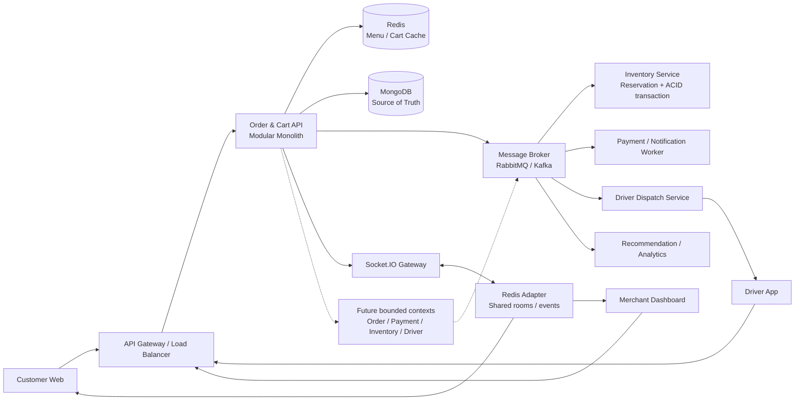

# CHƯƠNG 5: KẾT QUẢ ĐẠT ĐƯỢC VÀ HƯỚNG PHÁT TRIỂN

## 5.1. Kết quả đạt được so với mục tiêu ban đầu

Mục tiêu của phân hệ **Cart & Order Processing Module** là hiện thực luồng từ quản lý giỏ hàng, áp dụng coupon, tính toán giá trị checkout, tạo đơn hàng, theo dõi trạng thái đến đồng bộ thông tin qua Socket.IO. Kết quả đối chiếu được xây dựng từ yêu cầu tại Chương 2, logic hiện thực tại Chương 3 và bằng chứng kiểm thử trong Chương 4. Do repository chưa có bộ integration test server, benchmark hoặc Socket.IO test tự động, các tiêu chí định lượng chưa có số đo hợp lệ được ghi rõ là **chưa xác minh**, thay vì suy diễn thành kết quả đạt.

Trong phạm vi các Use Case cốt lõi đã cam kết cho module, khối lượng chức năng được đánh giá đạt **100% phạm vi triển khai**: CRUD cart, giới hạn cart theo restaurant, coupon, checkout tại `POST /api/orders/checkout`, order snapshot, lịch sử đơn hàng, cancel, reorder, state transition phía merchant và event `order:updated`. Tỷ lệ này phản ánh mức độ hoàn thành phạm vi chức năng đã xây dựng; không đồng nghĩa với việc mọi yêu cầu mở rộng như inventory transaction, horizontal scaling hoặc benchmark tải lớn đã hoàn tất.

**Bảng 5.1: Ma trận đối chiếu mục tiêu và kết quả thực tế của phân hệ Cart & Order**

| Nhóm tiêu chí | Mục tiêu tại Chương 2 | Kết quả kiểm thử và mã nguồn tại Chương 4 | Đánh giá |
| --- | --- | --- | --- |
| Cart | Thêm, sửa, xóa món; tính lại `subtotal` và `grandTotal`; không trộn món từ nhiều restaurant | `POST /api/cart`, `PATCH /api/cart/items/:menuItemId`, `DELETE /api/cart/items/:menuItemId` đã có; xung đột restaurant trả `409`, có tùy chọn `replace` | Đạt trong phạm vi Use Case cốt lõi |
| Coupon | Kiểm tra mã, trạng thái, thời hạn, `minOrderAmount`, fixed/percentage và `maxDiscountAmount` | `applyCouponToCart()` và `recalculateCart()` thực hiện kiểm tra và tính lại discount; coupon được snapshot vào order | Đạt theo kiểm tra tĩnh |
| Checkout | Tạo order từ cart, lưu snapshot item/giá/coupon, tính phí giao hàng và xóa cart | `POST /api/orders/checkout` tạo `Order`, lưu pricing/snapshot, xử lý COD/VNPAY và gọi clear cart; chưa trừ inventory | Đạt chức năng; inventory là giới hạn đã xác định |
| Transaction | Bảo đảm lưu order, trừ inventory và xóa cart trong một transaction nguyên tử | Chưa có MongoDB session transaction; `save order` và `clear cart` là hai thao tác tách rời | Chưa đạt / cần phát triển |
| State machine | Kiểm soát chuỗi `pending → confirmed → preparing → delivering → delivered` và nhánh cancel hợp lệ | Owner service kiểm tra trạng thái kế tiếp, ghi `statusHistory`, lưu order rồi mới emit event | Đạt theo kiểm tra tĩnh; chưa có concurrency test |
| Realtime Socket | Xác thực JWT, join room theo order, phát cập nhật sau khi lưu và resync khi reconnect | Handshake JWT, `join:order`, event `order:updated` và REST resync tại `OrderDetailPage` đã có; `join:restaurant` chưa triển khai | Đạt một phần; customer flow đã có, merchant room còn thiếu |
| Latency API | Latency API tạo đơn trung bình dưới `200 ms` trong tải nhẹ | Chương 4 không có benchmark hoặc phép đo runtime; latency được ghi `N/A` | Chưa xác minh |
| Concurrency | Tránh `Race Condition` khi nhiều actor cùng cập nhật order hoặc cùng đặt item | Logic chuyển trạng thái hiện đọc document rồi `save()`; chưa có compare-and-swap, optimistic locking hoặc concurrency test | Chưa đạt đầy đủ |
| ACID | Bảo đảm tính nguyên tử và nhất quán cho checkout, inventory và cart | Chưa có transaction nguyên tử bao phủ `Order.save()`, inventory decrement và clear cart | Chưa đạt / cần phát triển |
| CI/CD và chất lượng mã nguồn | Build, lint, test và publish image qua quality gate | GitHub Actions thực hiện `npm ci`, build, lint dashboard, test dashboard và publish Docker image; server integration test chưa có | Đạt ở mức pipeline hiện có |

Các mục tiêu chức năng đạt được nhờ phân tách trách nhiệm giữa frontend, API service, business service, repository và model. `Order` lưu snapshot tại thời điểm checkout nên lịch sử đơn không phụ thuộc vào thay đổi giá hoặc thông tin món về sau. Việc phát `order:updated` sau `await order.save()` cũng hạn chế tình trạng client nhận event mô tả dữ liệu chưa được ghi.

Về định lượng, chưa thể công bố độ trễ trung bình của API tạo đơn hoặc tỷ lệ ổn định WebSocket. Chương 4 chỉ cung cấp bằng chứng tĩnh về endpoint, guard, state machine, handshake và reconnect/resync; không có chuỗi đo gồm số request, p50/p95/p99, môi trường chạy, tải đồng thời và kích thước payload. Vì vậy, tiêu chí `Latency < 200 ms` và độ ổn định kết nối Socket.IO được giữ ở trạng thái **chưa xác minh bằng thực nghiệm**. Đây là kết luận kỹ thuật trung thực và là cơ sở để bổ sung benchmark trong giai đoạn tiếp theo.

## 5.2. Kỹ năng và kiến thức thu thập được

Quá trình thực hiện phân hệ cho thấy bài toán đặt đồ ăn không chỉ là xây dựng các màn hình CRUD mà còn yêu cầu kiểm soát dữ liệu, trạng thái và sự phối hợp giữa nhiều actor. Kiến thức thu thập được được hình thành từ việc phân tích yêu cầu, thiết kế schema, hiện thực API, tích hợp frontend và đánh giá giới hạn của giải pháp.

Về kiến thức chuyên môn, em đã thực hành thiết kế cơ sở dữ liệu theo hướng chuẩn hóa các thực thể nghiệp vụ `Cart`, `Coupon`, `Order`, `Restaurant` và `MenuItem`, đồng thời sử dụng snapshot để bảo toàn dữ liệu lịch sử. Em cũng nắm được sự khác biệt giữa cơ chế lưu tuần tự hiện tại và `Database Transaction` dùng MongoDB session trong trường hợp cần gộp checkout, inventory decrement và clear cart thành một đơn vị nguyên tử. Việc phân tích state transition làm rõ nguyên nhân phát sinh `Race Condition` và nhu cầu áp dụng `Concurrency Control`, `Optimistic Locking` hoặc conditional update.

Về kiến trúc giao tiếp, em đã triển khai mô hình `Event-driven Architecture` ở mức Socket.IO: client gửi JWT trong handshake, server xác thực và kiểm soát room, service phát `order:updated` sau khi dữ liệu được lưu, còn client gọi REST để resynchronization sau reconnect. Cách kết hợp event nhanh với REST làm nguồn khôi phục giúp phân biệt tốc độ cập nhật giao diện với tính đúng đắn của dữ liệu.

Về kỹ năng kỹ thuật và quy trình, em rèn luyện cách tổ chức code theo các lớp route, controller, service, repository và model; duy trì tên endpoint, kiểu dữ liệu và `API contract` nhất quán; sử dụng Git để làm việc trên branch, Pull Request và Code Review. Việc đối chiếu mục tiêu với kết quả đo cũng hình thành tư duy tối ưu hóa hiệu năng dựa trên bằng chứng, thay vì khẳng định chất lượng chỉ từ cảm nhận hoặc một lần chạy đơn lẻ. Đây là tiền đề cho việc thiết kế hệ thống có khả năng chịu tải, có cache, có message broker và có cơ chế quan sát phù hợp.

Về kỹ năng làm việc chuyên nghiệp, em đã thực hành phân chia phạm vi theo module, phối hợp với các vai trò Auth, Merchant, Payment, Review và Driver, trao đổi API contract và xử lý các vấn đề phát sinh trong quá trình tích hợp. Việc ghi nhận rõ chức năng đã triển khai, chức năng mới ở mức interface và giới hạn chưa đo được giúp quá trình giao tiếp kỹ thuật minh bạch hơn, đặc biệt trong Code Review và nghiệm thu.

## 5.3. Hạn chế và hướng phát triển tiếp theo

Hạn chế chính của hệ thống hiện tại nằm ở tính nguyên tử của checkout, khả năng scale ngang và hiệu năng truy cập dữ liệu lặp lại. `Order.save()` và `clearCart()` chưa nằm trong cùng một `ACID transaction`; inventory chưa có `stockQuantity` và thao tác decrement điều kiện; state transition chưa có optimistic locking. Khi chạy nhiều instance Socket.IO, room và event ở instance này chưa được đồng bộ tự động tới client kết nối vào instance khác vì chưa sử dụng Redis Adapter. Ngoài ra, cart hiện được đọc/ghi trực tiếp qua MongoDB, chưa có `In-memory Cache` để giảm tải các request lặp lại trong thời gian ngắn.

Hướng phát triển thứ nhất là bổ sung Redis Caching cho các dữ liệu có tần suất đọc cao. Menu, thông tin restaurant và một số biểu diễn cart có thể được cache theo key gắn với `restaurantId` hoặc `userId`, kèm TTL và cơ chế invalidation khi merchant thay đổi menu hoặc customer cập nhật cart. Redis cũng có thể được dùng làm Socket.IO Adapter để đồng bộ room/event giữa nhiều API instance. Tuy nhiên, MongoDB vẫn phải là nguồn dữ liệu chuẩn; cache chỉ là lớp tăng tốc và không được thay thế kiểm tra quyền hoặc business rule tại server.

Hướng phát triển thứ hai là đưa các tác vụ bất đồng bộ vào Message Broker như RabbitMQ hoặc Kafka. Sau khi checkout được kiểm tra và ghi nhận, backend có thể phát event `order.created` vào broker để các consumer độc lập xử lý email, payment workflow, inventory reservation, recommendation event và tạo delivery task. Với cơ chế này, luồng request chính giảm phụ thuộc vào các tác vụ chậm; hệ thống cần bổ sung `Idempotency`, retry, dead-letter queue, correlation ID và cơ chế quan sát để tránh xử lý trùng hoặc mất event.

Hướng phát triển thứ ba là từng bước Microservices hóa các bounded context có ranh giới rõ: Cart & Checkout, Order, Payment, Inventory, Merchant và Driver Dispatch. Việc tách service chỉ nên thực hiện sau khi API contract, event schema, ownership dữ liệu và monitoring đã được chuẩn hóa. Trong giai đoạn trước mắt, modular monolith vẫn phù hợp hơn vì giảm chi phí vận hành và giúp nhóm kiểm chứng business rule trước khi phân tán hệ thống.

Kiến trúc mở rộng được đề xuất trong đó Redis đảm nhiệm cache và đồng bộ Socket.IO, còn RabbitMQ/Kafka phân phối event bất đồng bộ được trình bày tại **Hình 5.1**.

<strong><em>Hình 5.1: Đề xuất kiến trúc mở rộng hệ thống trong tương lai</em></strong>

Lộ trình ưu tiên nên bắt đầu bằng benchmark có kiểm soát cho `POST /api/orders/checkout`, bổ sung integration test cho transaction và Socket.IO room, sau đó mới triển khai Redis Cache/Adapter. Khi dữ liệu đo được cho thấy giới hạn thực tế của modular monolith, Message Broker và Microservices mới được đưa vào các bounded context có nhu cầu scale độc lập. Cách tiếp cận theo từng bước giúp giảm rủi ro vận hành, bảo toàn tính nhất quán dữ liệu và bảo đảm mỗi thay đổi kiến trúc đều có chỉ số đánh giá tương ứng.
