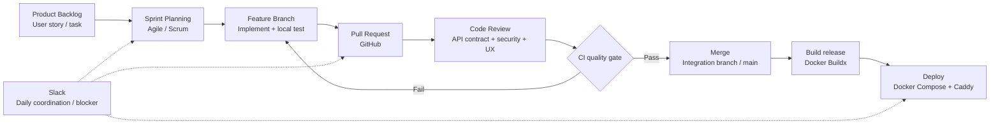
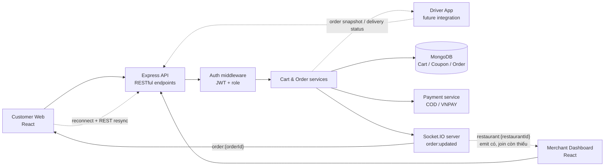
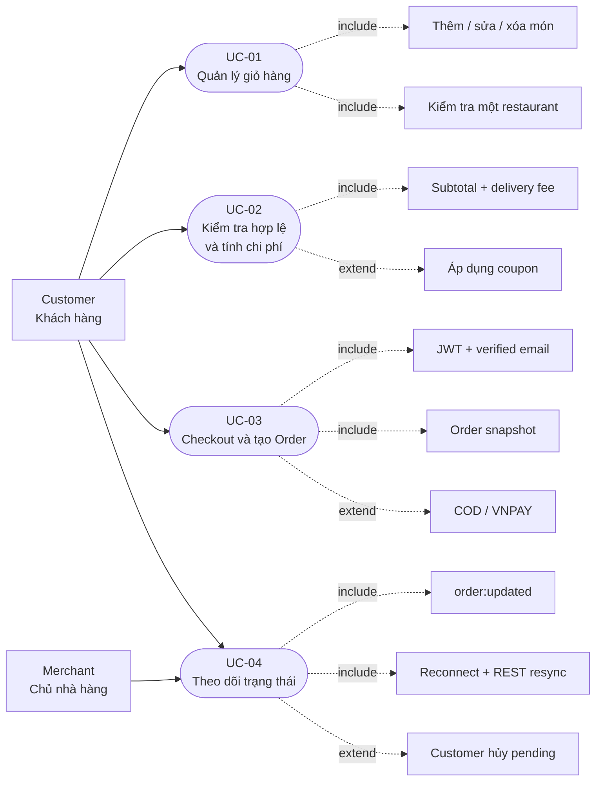
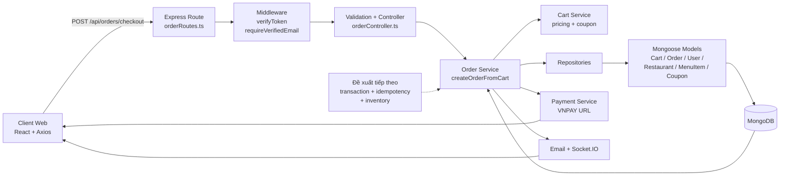
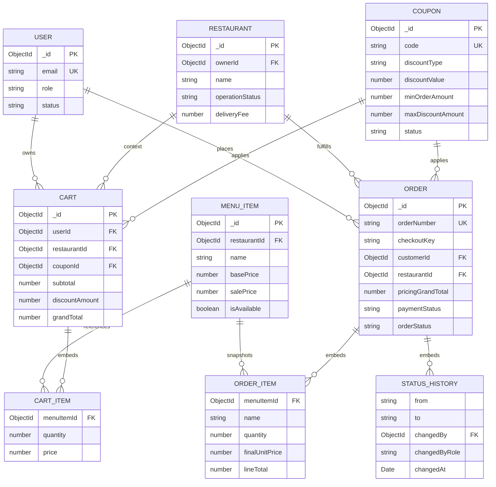
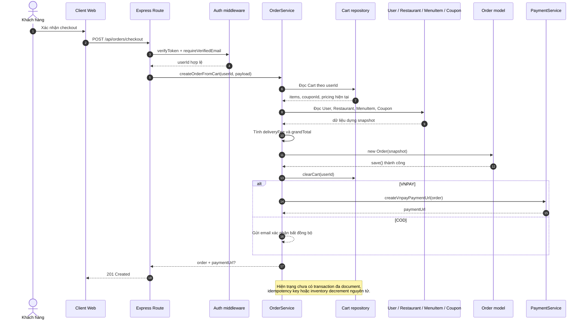
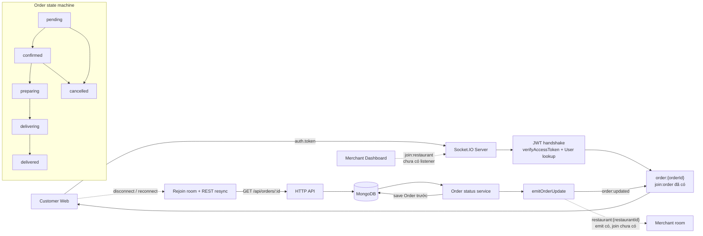
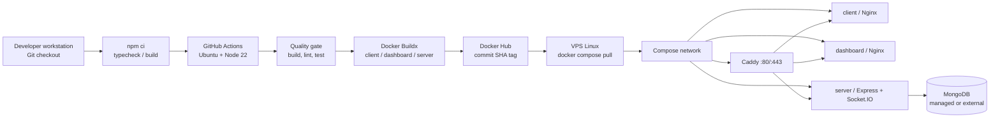
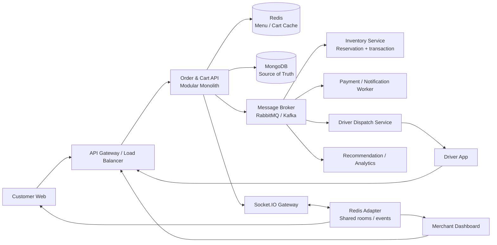

# BÁO CÁO HỌC PHẦN THỰC TẬP DOANH NGHIỆP NHẬT BẢN

**Tên đề tài:** Xây dựng nền tảng đặt đồ ăn (Food Ordering Platform)  
**Phân hệ phụ trách:** Giỏ hàng và Xử lý đơn hàng (Cart & Order Processing Module)  
**Sinh viên thực hiện:** Nguyễn Công Khải – MSV: 22026562  
**Đơn vị thực tập:** Công ty TNHH Phần mềm FPT (FPT Software) – Campuslink Front-End  
**Giảng viên đánh giá:** ThS. Lê Duy Đức  
**Cán bộ hướng dẫn doanh nghiệp:** Vũ Tú Anh  
**Đơn vị đào tạo:** Trường Đại học Công nghệ – Đại học Quốc gia Hà Nội

# MỤC LỤC

- Lời cảm ơn
- Chương 1: Giới thiệu chung
  - 1.1. Giới thiệu đơn vị thực tập
  - 1.2. Giới thiệu công việc và vai trò đảm nhiệm
  - 1.3. Tổng quan về dự án nền tảng đặt đồ ăn
- Chương 2: Phân tích yêu cầu bài toán
  - 2.1. Đặc tả bài toán tổng thể của hệ thống
  - 2.2. Yêu cầu chức năng và phi chức năng
  - 2.3. Kế hoạch phân công công việc và phạm vi đảm nhiệm cá nhân
- Chương 3: Thiết kế và cài đặt hệ thống
  - 3.1. Cơ sở công nghệ và giải pháp kỹ thuật
  - 3.2. Kiến trúc giải pháp và thiết kế hệ thống
  - 3.3. Hiện thực hóa các tính năng cốt lõi
- Chương 4: Kiểm thử, triển khai và vận hành hệ thống
  - 4.1. Kiểm thử hệ thống
  - 4.2. Quy trình thiết lập và triển khai hệ thống
- Chương 5: Kết quả đạt được và hướng phát triển
  - 5.1. Kết quả đạt được
  - 5.2. Hạn chế và hướng phát triển trong tương lai
- Tài liệu tham khảo

# LỜI CẢM ƠN

Em xin trân trọng cảm ơn Ban Giám hiệu, các thầy cô Khoa Công nghệ Thông tin – Trường Đại học Công nghệ, Đại học Quốc gia Hà Nội đã tạo điều kiện để em được tham gia học phần Thực tập doanh nghiệp. Học phần đã giúp em có cơ hội vận dụng kiến thức chuyên ngành vào một bài toán phần mềm cụ thể, đồng thời làm quen với quy trình phát triển sản phẩm trong môi trường doanh nghiệp. Em xin gửi lời cảm ơn tới Công ty TNHH Phần mềm FPT (FPT Software) đã tiếp nhận, hướng dẫn và tạo môi trường làm việc thực tế chuyên nghiệp thông qua chương trình Campuslink Front-End.

Em xin bày tỏ lòng biết ơn tới ThS. Lê Duy Đức, giảng viên đánh giá, đã tận tình định hướng chuyên môn, góp ý nội dung và hỗ trợ em hoàn thiện báo cáo. Em đồng thời chân thành cảm ơn anh Vũ Tú Anh, cán bộ hướng dẫn tại FPT Software, đã chỉ bảo cặn kẽ về tư duy kỹ thuật, cách phân tích yêu cầu, văn hóa làm việc và phương pháp phối hợp trong dự án phần mềm.

Em cũng xin cảm ơn các thành viên trong nhóm thực tập đã phối hợp nhịp nhàng, hỗ trợ lẫn nhau trong quá trình phân tích, thiết kế, lập trình, kiểm thử và tích hợp. Sự nỗ lực của cả nhóm là yếu tố quan trọng giúp sản phẩm được hoàn thiện theo kế hoạch. Do giới hạn về thời gian và kinh nghiệm, báo cáo khó tránh khỏi thiếu sót; em mong nhận được ý kiến đóng góp để tiếp tục cải thiện kiến thức và kỹ năng chuyên môn.

# CHƯƠNG 1: GIỚI THIỆU CHUNG

## 1.1. Giới thiệu đơn vị thực tập

FPT Software là doanh nghiệp công nghệ của Việt Nam, hoạt động trong các lĩnh vực xuất khẩu phần mềm, tư vấn chuyển đổi số, phát triển sản phẩm và vận hành hệ thống cho khách hàng trong nước và quốc tế. Với các dự án phục vụ thị trường Nhật Bản, quy trình làm việc chú trọng tính kỷ luật, chất lượng sản phẩm, khả năng truy vết thay đổi và sự chính xác trong giao tiếp kỹ thuật.

Đặc thù của môi trường dự án Nhật Bản thể hiện qua việc tuân thủ quy trình báo cáo, liên lạc và thảo luận thường được gọi là Ho-Ren-So. Thành viên dự án cần chủ động báo cáo tiến độ, chia sẻ rủi ro, làm rõ yêu cầu và ghi nhận các quyết định kỹ thuật. Bên cạnh năng lực lập trình, khả năng phối hợp, quản lý thời gian và duy trì chất lượng tài liệu cũng là những yêu cầu quan trọng.

Campuslink Front-End là chương trình đào tạo và thực hành giúp sinh viên tiếp cận quy trình phát triển phần mềm tại doanh nghiệp. Trong chương trình, sinh viên được làm việc theo nhóm, sử dụng công cụ quản lý mã nguồn, thực hiện nhiệm vụ theo Sprint và phối hợp thông qua Pull Request. Qua đó, sinh viên có thể rèn luyện kỹ năng thực chiến, hiểu vai trò của từng thành viên và chuẩn hóa cách xây dựng một sản phẩm phần mềm.

Nhóm áp dụng Agile/Scrum để lập kế hoạch và theo dõi tiến độ. Mỗi thay đổi được phát triển trên feature branch, gửi Pull Request, trải qua Code Review và được kiểm tra bởi pipeline CI/CD trước khi tích hợp. Quy trình phát triển phần mềm và kiểm soát mã nguồn của dự án được minh họa tại Hình 1.1.



<div align="center"><strong><em>Hình 1.1: Quy trình phát triển phần mềm và kiểm soát mã nguồn dự án</em></strong></div>

## 1.2. Giới thiệu công việc và vai trò đảm nhiệm

Trong chương trình thực tập, em đảm nhiệm vị trí Fullstack Web Developer Intern. Công việc bao gồm nghiên cứu công nghệ, phân tích yêu cầu, thiết kế dữ liệu, phát triển API phía máy chủ, xây dựng giao diện phía khách hàng và phối hợp tích hợp giữa các phân hệ.

Phạm vi chuyên môn chính của em là phân hệ Giỏ hàng và Xử lý đơn hàng. Đây là phân hệ kết nối trực tiếp giữa thao tác lựa chọn món của khách hàng, dữ liệu nhà hàng, mã giảm giá, phí giao hàng, thanh toán và trạng thái vận hành đơn hàng. Vì có nhiều thành phần cùng tham gia, mọi thay đổi trong giá món, coupon, địa chỉ hoặc trạng thái đều cần được xem xét trên cả frontend, backend và cơ sở dữ liệu.

Các công việc nghiên cứu và thiết kế gồm lựa chọn kiến trúc module hóa, phân tích lược đồ dữ liệu, xác định API contract giữa các phân hệ, thiết kế state machine của đơn hàng và lựa chọn Socket.IO cho giao tiếp thời gian thực. Trong quá trình này, em chú trọng bảo đảm dữ liệu giá và thông tin liên quan được snapshot tại thời điểm checkout để lịch sử đơn không bị thay đổi khi menu được cập nhật.

Ở phía backend, em tham gia xây dựng các chức năng CRUD giỏ hàng, kiểm tra giỏ hàng chỉ thuộc một nhà hàng, áp dụng coupon, tính phí giao hàng, checkout, lịch sử đơn hàng, hủy đơn, đặt lại đơn và chuyển trạng thái đơn phía nhà hàng. Ở phía frontend, em làm việc với các màn hình giỏ hàng, checkout, lịch sử đơn và chi tiết đơn, đồng thời kết nối API và xử lý đồng bộ trạng thái.

Quy trình phát triển được thực hiện theo từng Sprint. Mã nguồn được kiểm soát bằng Git Flow; thay đổi được thực hiện trên feature branch, kiểm tra cục bộ, mở Pull Request, nhận Code Review và chạy quality gate trên GitHub Actions trước khi merge. Những nội dung chưa có kiểm thử runtime hoặc benchmark được trình bày là chưa xác minh, không suy diễn thành kết quả định lượng.

## 1.3. Tổng quan về dự án nền tảng đặt đồ ăn

Sự phát triển của dịch vụ giao đồ ăn trực tuyến tạo ra nhu cầu xây dựng một nền tảng kết nối đồng bộ giữa Khách hàng (Customer), Chủ nhà hàng (Merchant) và Tài xế (Driver). Khách hàng cần tìm kiếm món ăn, tạo giỏ hàng, đặt món, thanh toán và theo dõi đơn. Nhà hàng cần quản lý thực đơn, tiếp nhận đơn và cập nhật tiến độ chế biến. Tài xế cần nhận thông tin giao hàng và phản hồi trạng thái vận chuyển.

Luồng nghiệp vụ tổng quát của nền tảng là: khách hàng duyệt menu, chọn món, áp mã giảm giá, tính phí giao hàng, checkout tạo đơn, nhà hàng tiếp nhận và cập nhật trạng thái, tài xế giao hàng, sau đó khách hàng đánh giá chất lượng món ăn. Các tác nhân cùng sử dụng dữ liệu đơn hàng nên hệ thống phải bảo đảm tính nhất quán giữa giao diện, API, cơ sở dữ liệu và kênh realtime.

Ngay từ đầu, nhóm thống nhất một số quyết định kỹ thuật quan trọng. Hệ thống được tổ chức theo các module độc lập để phân chia trách nhiệm rõ ràng. `Order` lưu snapshot thông tin món, nhà hàng, khách hàng và pricing tại thời điểm checkout để bảo toàn lịch sử thanh toán. RESTful API được sử dụng cho các thao tác cần dữ liệu chuẩn; Socket.IO được sử dụng để thông báo trạng thái gần thời gian thực.

Trong phạm vi repository hiện tại, các chức năng cốt lõi của Customer, Merchant và Cart & Order đã được xây dựng. Driver mới dừng ở mức interface tích hợp thông qua thông tin giao hàng và trạng thái đơn; service điều phối tài xế độc lập là hướng phát triển tiếp theo. Inventory service và transaction đa document cũng chưa được hoàn thiện, vì vậy đây là các giới hạn cần lưu ý khi đánh giá mức độ sẵn sàng production.

Mô hình kết nối giữa các tác nhân, API, cơ sở dữ liệu và kênh realtime được trình bày tại Hình 1.2.



<div align="center"><strong><em>Hình 1.2: Mô hình tương tác giữa các tác nhân trong hệ sinh thái đặt đồ ăn</em></strong></div>

# CHƯƠNG 2: PHÂN TÍCH YÊU CẦU BÀI TOÁN

## 2.1. Đặc tả bài toán tổng thể của hệ thống

Mục tiêu của hệ thống là xây dựng một giải pháp web quản lý và đặt món ăn toàn diện. Đối với khách hàng, hệ thống hỗ trợ tìm kiếm nhà hàng, xem thực đơn, thêm hoặc chỉnh sửa món trong giỏ, áp dụng voucher, nhập địa chỉ, lựa chọn phương thức thanh toán, tạo đơn, theo dõi trạng thái và đánh giá sau khi nhận hàng. Đối với nhà hàng, hệ thống hỗ trợ quản lý thực đơn, tiếp nhận đơn và xử lý đơn theo từng trạng thái.

Luồng nghiệp vụ End-to-End bắt đầu khi khách hàng duyệt menu và chọn món. Các món được thêm vào giỏ thuộc một nhà hàng duy nhất. Trước khi checkout, hệ thống tính subtotal, kiểm tra coupon, tính phí giao hàng và xác định tổng tiền ở phía máy chủ. Khi tạo đơn, dữ liệu được kiểm tra lại, snapshot được dựng từ dữ liệu server, order được lưu và giỏ hàng được xóa. Sau đó, các thay đổi trạng thái được phát tới những client liên quan.

Hệ thống phải giải quyết các vấn đề nghiệp vụ và kỹ thuật gồm: không cho phép trộn món từ nhiều nhà hàng trong một giỏ; không tin cậy giá trị tổng tiền do client gửi; ngăn truy cập đơn hàng của người dùng khác; chỉ cho phép chuyển trạng thái theo quy tắc; hạn chế tạo trùng đơn khi người dùng gửi lại request; và duy trì khả năng đồng bộ khi kết nối Socket.IO bị gián đoạn.

Phạm vi trọng tâm của báo cáo là phân tích, thiết kế và hiện thực hóa phân hệ Giỏ hàng và Xử lý đơn hàng do em trực tiếp đảm nhiệm. Các phân hệ Auth, Merchant, Payment, Review và Driver được trình bày ở mức interface cần phối hợp. Các chỉ tiêu như latency p95 dưới 200 ms hoặc độ trễ event dưới 1 giây là mục tiêu kiểm thử; nếu chưa có benchmark thì không được xem là kết quả đã đạt.

## 2.2. Yêu cầu chức năng và phi chức năng

Hệ thống có hai tác nhân trực tiếp trong phạm vi phân hệ là Customer và Merchant. Auth, Admin/System và Driver là các phân hệ phối hợp hoặc interface tích hợp, không được đưa vào sơ đồ use case cốt lõi để tránh thể hiện vượt quá phạm vi code hiện tại. Quan hệ giữa các tác nhân và nhóm use case được thể hiện tại Hình 2.1.



<div align="center"><strong><em>Hình 2.1: Sơ đồ ca sử dụng phân hệ Giỏ hàng và Đơn hàng</em></strong></div>

Phân hệ Cart & Order được tập trung vào bốn nhóm use case cốt lõi:

1. **UC-01 – Quản lý giỏ hàng:** xem, thêm, sửa, xóa món và thay thế giỏ khi người dùng xác nhận chuyển sang nhà hàng khác.
2. **UC-02 – Tính toán chi phí và kiểm tra tính hợp lệ:** kiểm tra món, số lượng, coupon, phí giao hàng, subtotal, discount và grand total.
3. **UC-03 – Khởi tạo đơn hàng và thanh toán:** xác thực người dùng, tạo order snapshot, xử lý COD hoặc chuyển tiếp tới cổng thanh toán.
4. **UC-04 – Theo dõi và đồng bộ trạng thái:** nhận cập nhật `order:updated`, hiển thị trạng thái mới và gọi REST resynchronization khi reconnect.

Các yêu cầu chức năng chính được tổng hợp trong Bảng 2.1.

**Bảng 2.1: Danh mục yêu cầu chức năng của phân hệ Cart & Order**

| Mã | Yêu cầu | Mô tả |
| --- | --- | --- |
| FR-01 | Quản lý giỏ hàng | Customer có thể xem, thêm, sửa số lượng và xóa món trong giỏ. |
| FR-02 | Giới hạn nhà hàng | Một cart chỉ chứa món của một restaurant; xung đột trả mã `409` hoặc thay thế khi có xác nhận. |
| FR-03 | Kiểm tra món | Server kiểm tra `menuItemId`, availability, restaurant và giá hiện hành trước khi tính tiền. |
| FR-04 | Coupon | Server kiểm tra mã, trạng thái, thời hạn, giá trị đơn tối thiểu và mức giảm tối đa. |
| FR-05 | Tính phí | Tính `subtotal`, `discountAmount`, `deliveryFee` và `grandTotal` ở server. |
| FR-06 | Checkout | Tạo order từ cart tại `POST /api/orders/checkout`, lưu snapshot và xóa cart sau khi tạo đơn. |
| FR-07 | Theo dõi đơn | Customer xem lịch sử, chi tiết, hủy đơn pending và đặt lại đơn đã hoàn thành. |
| FR-08 | Xử lý phía merchant | Merchant chuyển order theo state machine và ghi nhận lịch sử trạng thái. |
| FR-09 | Realtime | Phát `order:updated` tới room của order sau khi dữ liệu được lưu. |
| FR-10 | Phân quyền | Chỉ customer sở hữu order hoặc merchant của restaurant mới được truy cập dữ liệu tương ứng. |

Các yêu cầu phi chức năng được tổng hợp trong Bảng 2.2.

**Bảng 2.2: Danh mục yêu cầu phi chức năng**

| Mã | Nhóm | Yêu cầu/tiêu chí |
| --- | --- | --- |
| NFR-01 | Hiệu năng | Mục tiêu kiểm thử API là latency p95 dưới 200 ms trong tải chuẩn. |
| NFR-02 | Tính toàn vẹn | Order phải lưu snapshot; mục tiêu tiếp theo là ACID transaction cho Order, Cart và Inventory. |
| NFR-03 | Idempotency | Một yêu cầu checkout có cùng idempotency key không được tạo nhiều order. |
| NFR-04 | Realtime | Mục tiêu độ trễ event `order:updated` dưới 1 giây sau commit trong cùng instance. |
| NFR-05 | Bảo mật | Private API và Socket.IO handshake phải xác thực JWT, kiểm tra role và quyền sở hữu. |
| NFR-06 | Validation | Payload sai, ObjectId không hợp lệ và số lượng không hợp lệ phải bị chặn trước khi ghi DB. |
| NFR-07 | Khả năng phục hồi | Khi WebSocket mất kết nối, client phải reconnect và gọi REST để đồng bộ lại. |
| NFR-08 | Truy vết | Các thay đổi trạng thái cần có actor, role, thời gian và trạng thái trước/sau. |

## 2.3. Kế hoạch phân công công việc và phạm vi đảm nhiệm cá nhân

Kế hoạch phát triển được nhóm lập theo các nhóm chức năng độc lập và triển khai trong khoảng thời gian từ ngày 05/08/2026 đến ngày 11/08/2026. Mỗi đầu việc có người phụ trách chính, thời gian thực hiện, trạng thái và yêu cầu bàn giao cụ thể. Cách lập kế hoạch này giúp nhóm theo dõi tiến độ theo Sprint, xác định rõ trách nhiệm cá nhân và kiểm soát các phụ thuộc giữa các phân hệ.

Tổng thể kế hoạch gồm chín nhóm chức năng: Khởi tạo và Thiết kế; Authentication; Quản lý nhà hàng và Thực đơn; Giỏ hàng và Đặt món; Dashboard thống kê; Thanh toán và Email; Tích hợp và Kiểm thử; Hoàn thiện và Triển khai; Chức năng nâng cao. Tiến độ và phân công chi tiết được tổng hợp trong Bảng 2.3.

**Bảng 2.3: Kế hoạch phân công công việc và tiến độ thực hiện của nhóm**

| STT | Hạng mục / Chức năng | Chức năng chi tiết | Người phụ trách | Bắt đầu | Kết thúc | Trạng thái | Ghi chú / Yêu cầu |
| ---: | --- | --- | --- | --- | --- | --- | --- |
| 1 | 1. Khởi tạo & Thiết kế | Thống nhất yêu cầu dự án | Cả team | 05/08/2026 | 05/08/2026 | Đã hoàn thành | Thống nhất scope và luồng nghiệp vụ |
| 2 | 1. Khởi tạo & Thiết kế | Thiết kế Database | Cả team | 05/08/2026 | 05/08/2026 | Đã hoàn thành | Thiết kế schema các bảng |
| 3 | 1. Khởi tạo & Thiết kế | Thiết kế API và giao diện tổng quan | Cả team | 05/08/2026 | 05/08/2026 | Đã hoàn thành | Thống nhất API endpoints và UI layout |
| 4 | 2. Authentication | Đăng ký, đăng nhập, đăng xuất | Cường | 05/08/2026 | 08/08/2026 | Đã hoàn thành | Chức năng xác thực người dùng |
| 5 | 2. Authentication | Phân quyền ba role: Admin, Restaurant Owner, Customer | Cường | 05/08/2026 | 08/08/2026 | Đã hoàn thành | Quản lý quyền hạn hệ thống |
| 6 | 2. Authentication | Bảo vệ route theo role | Cường | 05/08/2026 | 08/08/2026 | Đã hoàn thành | Middleware và route protection |
| 7 | 3. Quản lý nhà hàng & Thực đơn | Danh sách nhà hàng với bộ lọc theo danh mục món | Hùng | 05/08/2026 | 08/08/2026 | Đã hoàn thành | Filter theo danh mục món ăn |
| 8 | 3. Quản lý nhà hàng & Thực đơn | Tìm kiếm nhà hàng theo tên và địa chỉ | Hùng | 05/08/2026 | 08/08/2026 | Đã hoàn thành | Search box tìm kiếm |
| 9 | 3. Quản lý nhà hàng & Thực đơn | Trang chi tiết nhà hàng: thực đơn, giá, đánh giá | Hùng | 05/08/2026 | 08/08/2026 | Đã hoàn thành | Hiển thị chi tiết menu và mức giá |
| 10 | 3. Quản lý nhà hàng & Thực đơn | Restaurant Owner: thêm, sửa, xóa món ăn; cập nhật trạng thái kho | Hùng | 05/08/2026 | 08/08/2026 | Đã hoàn thành | CRUD món ăn và trạng thái kho |
| 11 | 4. Giỏ hàng & Đặt món | Thêm, xóa món; cập nhật số lượng trong giỏ hàng | Khải | 05/08/2026 | 08/08/2026 | Đã hoàn thành | Quản lý giỏ hàng |
| 12 | 4. Giỏ hàng & Đặt món | Chỉ cho phép đặt món từ một nhà hàng trong một đơn | Khải | 05/08/2026 | 08/08/2026 | Đã hoàn thành | Validation logic giỏ hàng |
| 13 | 4. Giỏ hàng & Đặt món | Nhập địa chỉ giao hàng; ghi chú đơn hàng | Khải | 05/08/2026 | 08/08/2026 | Đã hoàn thành | Form địa chỉ và ghi chú |
| 14 | 4. Giỏ hàng & Đặt món | Lịch sử đơn hàng với trạng thái: pending / confirmed | Khải | 05/08/2026 | 08/08/2026 | Đã hoàn thành | Quản lý trạng thái đơn hàng |
| 15 | 5. Dashboard thống kê | Tổng doanh thu, tổng đơn hàng, món ăn bán chạy | Khải | 05/08/2026 | 08/08/2026 | Đã hoàn thành | Thống kê tổng quan |
| 16 | 5. Dashboard thống kê | Thống kê doanh thu theo ngày, tháng, năm; theo nhà hàng | Khải | 05/08/2026 | 08/08/2026 | Đã hoàn thành | Bộ lọc thống kê nâng cao |
| 17 | 5. Dashboard thống kê | Hai loại biểu đồ thống kê | Khải | 05/08/2026 | 08/08/2026 | Đã hoàn thành | Tích hợp thư viện biểu đồ |
| 18 | 6. Thanh toán & Email | Tìm hiểu và tích hợp cổng thanh toán VNPay / Mock Payment | Cường | 09/08/2026 | 10/08/2026 | Đã hoàn thành | Tích hợp cổng thanh toán |
| 19 | 6. Thanh toán & Email | Hỗ trợ thanh toán khi nhận hàng (COD) | Cường | 09/08/2026 | 10/08/2026 | Đã hoàn thành | Xử lý luồng COD |
| 20 | 6. Thanh toán & Email | Gửi email xác nhận đơn hàng sau khi đặt thành công | Cường | 09/08/2026 | 10/08/2026 | Đã hoàn thành | Cấu hình mailer và HTML template |
| 21 | 7. Tích hợp & Kiểm thử | Tích hợp các chức năng hệ thống | Cả team | 10/08/2026 | 11/08/2026 | Đã hoàn thành | Ghép nối các module |
| 22 | 7. Tích hợp & Kiểm thử | Kiểm thử phân quyền; luồng đặt món và thanh toán | Cả team | 10/08/2026 | 11/08/2026 | Đã hoàn thành | Kiểm thử End-to-End |
| 23 | 8. Hoàn thiện & Triển khai | Sửa lỗi (Bug fixing) và hoàn thiện giao diện UI/UX | Cả team | 10/08/2026 | 11/08/2026 | Đã hoàn thành | Tối ưu hóa sản phẩm |
| 24 | 8. Hoàn thiện & Triển khai | Triển khai sản phẩm (Deployment) | Cả team | 10/08/2026 | 11/08/2026 | Chưa bắt đầu | Deploy Backend và Frontend |
| 25 | 9. Chức năng nâng cao | Đánh giá nhà hàng: Rating và review sau khi nhận hàng | Hùng | 10/08/2026 | 11/08/2026 | Đã hoàn thành | Phụ trách chính bởi Hùng |
| 26 | 9. Chức năng nâng cao | Theo dõi đơn hàng realtime | Khải | 10/08/2026 | 11/08/2026 | Đã hoàn thành | Bổ sung nếu kịp tiến độ |
| 27 | 9. Chức năng nâng cao | Mã giảm giá (Coupon khi thanh toán) | Cường | 10/08/2026 | 11/08/2026 | Đã hoàn thành | Bổ sung nếu kịp tiến độ |
| 28 | 9. Chức năng nâng cao | Gợi ý món ăn dựa trên lịch sử đặt hàng | Hùng | 10/08/2026 | 11/08/2026 | Chưa bắt đầu | Bổ sung nếu kịp tiến độ |

Trong kế hoạch trên, em là người phụ trách chính các đầu việc từ STT 11 đến STT 17 và STT 26. Phạm vi này bao gồm quản lý vòng đời giỏ hàng, ràng buộc mỗi đơn chỉ thuộc một nhà hàng, tiếp nhận địa chỉ và ghi chú giao hàng, hiển thị lịch sử đơn, xây dựng dashboard thống kê và theo dõi trạng thái đơn hàng theo thời gian thực.

Đối với nhóm Giỏ hàng & Đặt món, em thực hiện các thao tác thêm, xóa và cập nhật số lượng món; kiểm tra xung đột khi người dùng chọn món từ nhiều nhà hàng; xây dựng form địa chỉ giao hàng; lưu ghi chú đơn; và hiển thị lịch sử đơn theo các trạng thái nghiệp vụ. Các chức năng này tạo thành chuỗi nghiệp vụ chính từ lúc khách hàng lựa chọn món đến khi theo dõi đơn hàng.

Đối với Dashboard thống kê, em phụ trách tổng hợp doanh thu, số lượng đơn hàng, món ăn bán chạy, bộ lọc theo ngày/tháng/năm và nhà hàng, đồng thời tích hợp hai loại biểu đồ để trực quan hóa dữ liệu. Đối với chức năng nâng cao, em triển khai theo dõi đơn hàng realtime bằng Socket.IO, kết hợp cập nhật sự kiện `order:updated` và gọi REST API để đồng bộ lại dữ liệu khi kết nối được thiết lập lại.

Các đầu việc của Cường tập trung vào Authentication, phân quyền, bảo vệ route, thanh toán VNPay/Mock Payment, COD, email xác nhận và coupon. Các đầu việc của Hùng tập trung vào quản lý nhà hàng, thực đơn, tìm kiếm, trang chi tiết nhà hàng, đánh giá và review. Các nhiệm vụ do cả team phụ trách gồm khởi tạo thiết kế, tích hợp module, kiểm thử End-to-End và hoàn thiện giao diện.

Theo bảng tiến độ, phần lớn chức năng nghiệp vụ đã hoàn thành. Hai đầu việc còn ở trạng thái “Chưa bắt đầu” là triển khai sản phẩm Backend/Frontend và gợi ý món ăn dựa trên lịch sử đặt hàng. Vì vậy, báo cáo phân biệt rõ các chức năng đã hoàn thành với các hạng mục mới dừng ở kế hoạch, không xem Deployment và Recommendation là kết quả đã bàn giao.

# CHƯƠNG 3: THIẾT KẾ VÀ CÀI ĐẶT HỆ THỐNG

## 3.1. Cơ sở công nghệ và giải pháp kỹ thuật

Hệ thống sử dụng monorepo npm workspaces gồm customer web, dashboard và API server. Frontend sử dụng React, TypeScript, Vite và React Router để xây dựng giao diện theo component. TypeScript giúp mô tả rõ payload, response và trạng thái của các thực thể. Backend sử dụng Node.js và Express vì phù hợp với xử lý I/O bất đồng bộ, xây dựng RESTful API và tích hợp Socket.IO.

MongoDB được lựa chọn làm cơ sở dữ liệu vì phù hợp với document `Order` có các embedded item, snapshot và status history. Mongoose hỗ trợ schema, `required`, `enum`, `min`, index và populate. Cách lưu snapshot giúp order vẫn giữ đúng tên món, giá và thông tin nhà hàng tại thời điểm checkout ngay cả khi dữ liệu gốc thay đổi sau đó.

Socket.IO được dùng cho truyền thông hai chiều giữa client và server, hỗ trợ xác thực trong handshake, quản lý room theo order và phát event trạng thái. GitHub Actions thực hiện quality gate; Docker/Docker Compose đóng gói các service; Caddy làm reverse proxy và TLS khi triển khai. VNPAY được tích hợp ở mức payment hand-off, bên cạnh phương thức COD.

Việc kết hợp REST và Socket.IO tạo ra mô hình cân bằng giữa tính đúng đắn và trải nghiệm. REST là nguồn dữ liệu chuẩn cho CRUD, checkout và resynchronization; Socket.IO chỉ thông báo thay đổi để UI cập nhật nhanh. Khi Socket.IO bị gián đoạn, client vẫn có thể gọi REST để lấy trạng thái hiện tại.

## 3.2. Kiến trúc giải pháp và thiết kế hệ thống

### 3.2.1. Kiến trúc phân tầng tổng thể

Kiến trúc được tổ chức theo các tầng Client, API Router, Controller, Service, Model/Repository và Database. Cách phân tầng giúp tách trách nhiệm: route xử lý định tuyến, middleware xác thực và validation, controller tiếp nhận request, service thực hiện business logic, repository/model giao tiếp với MongoDB.

Client gửi request HTTPS tới Express Router. Sau khi JWT và quyền truy cập được kiểm tra, controller gọi service xử lý nghiệp vụ. Service đọc cart, kiểm tra menu và coupon, tính giá, dựng snapshot rồi lưu order. Sau khi lưu thành công, payment service, email service và Socket.IO xử lý các side effect. Kiến trúc phân tầng và ranh giới cải tiến được minh họa tại Hình 3.1.



<div align="center"><strong><em>Hình 3.1: Sơ đồ kiến trúc phân tầng của hệ thống</em></strong></div>

Trong kiến trúc hiện tại, `Order.save()` và thao tác xóa cart vẫn là hai bước tách rời. Ranh giới transaction đa document được xác định là mục tiêu cải tiến, bao gồm tạo order, ghi coupon usage, trừ inventory và xóa cart trong cùng MongoDB session. Email và Socket.IO nên được thực hiện sau commit để tránh phát dữ liệu chưa bền vững.

### 3.2.2. Thiết kế cơ sở dữ liệu

Các thực thể trọng tâm của phân hệ gồm `Cart`, `CartItem`, `Order`, `OrderItemSnapshot`, `Coupon`, `Restaurant` và `MenuItem`. `Cart` biểu diễn lựa chọn tạm thời của customer; `Order` là chứng từ giao dịch sau checkout. Quan hệ giữa các thực thể và các trường snapshot được thể hiện tại Hình 3.2.



<div align="center"><strong><em>Hình 3.2: Lược đồ quan hệ thực thể (ERD) phân hệ Giỏ hàng và Đơn hàng</em></strong></div>

`Cart` chứa `userId`, `restaurantId`, danh sách items, coupon và các giá trị tính toán. Mỗi item có `menuItemId`, số lượng và giá tại thời điểm thêm vào. `Order` lưu `customerSnapshot`, `restaurantSnapshot`, recipient, địa chỉ giao hàng, danh sách `OrderItemSnapshot`, coupon snapshot, pricing, payment status, order status và status history.

Thiết kế snapshot là quyết định quan trọng để bảo toàn lịch sử. Nếu restaurant thay đổi tên, menu item thay đổi giá hoặc coupon bị vô hiệu hóa sau checkout, dữ liệu trong order vẫn phản ánh đúng giao dịch đã phát sinh. Các trường tham chiếu `ObjectId` và index hỗ trợ truy vấn lịch sử customer, dashboard restaurant và payment status.

Tuy nhiên, MongoDB chỉ bảo đảm atomicity ở mức document nếu chưa dùng session transaction. Vì vậy, việc tạo order và xóa cart có thể không đồng nhất nếu một bước thất bại. Inventory cũng chưa có `stockQuantity` và cơ chế decrement điều kiện; đây là giới hạn được đưa vào phần hướng phát triển.

## 3.3. Hiện thực hóa các tính năng cốt lõi

### 3.3.1. Hiện thực tính năng Giỏ hàng và Xử lý đơn hàng

Giỏ hàng được thiết kế theo quy tắc mỗi cart chỉ thuộc một restaurant. Khi customer thêm món từ restaurant khác, service kiểm tra `restaurantId` và trả lỗi `409` nếu request không có tùy chọn thay thế. Khi người dùng xác nhận thay thế, cart cũ được xóa hoặc làm rỗng trước khi thêm món mới.

Khi cập nhật số lượng, service kiểm tra menu item, availability, giới hạn số lượng và tính lại subtotal. Coupon không được tin cậy từ client; server đọc coupon, kiểm tra trạng thái, thời hạn, giá trị tối thiểu, loại giảm giá và mức giảm tối đa. Phí giao hàng được lấy từ cấu hình restaurant. Các giá trị `subtotal`, `discountAmount`, `deliveryFee` và `grandTotal` đều được tính lại tại server.

Luồng checkout tại `POST /api/orders/checkout` gồm các bước: xác thực JWT và email; lấy cart theo `userId`; kiểm tra restaurant và menu; revalidate coupon; tính pricing; tạo snapshot customer, restaurant và item; lưu order ở trạng thái `pending`; xử lý COD hoặc tạo payment URL; xóa cart; sau đó gửi các side effect cần thiết.

Luồng thực tế đang chạy được mô tả tại Hình 3.3. Sơ đồ cố ý không đưa transaction, idempotency key hoặc inventory decrement vào luồng hiện tại; đây là các nội dung thuộc hướng hoàn thiện.



<div align="center"><strong><em>Hình 3.3: Biểu đồ tuần tự luồng checkout hiện tại</em></strong></div>

State machine của order cho phép các chuyển đổi chính `pending → confirmed`, `confirmed → preparing`, `preparing → delivering`, `delivering → delivered` và các nhánh hủy theo điều kiện. Customer chỉ được hủy khi order còn `pending`; merchant phải thuộc restaurant tương ứng. Mỗi thay đổi trạng thái được ghi vào `statusHistory` để hỗ trợ truy vết.

Hiện trạng đã có kiểm tra transition nhưng chưa có compare-and-swap hoặc Optimistic Locking cho trường hợp nhiều actor cập nhật cùng lúc. Checkout cũng chưa có MongoDB Multi-document Transaction và idempotency key do client cung cấp. Vì vậy, các yêu cầu về chống race condition và chống tạo trùng cần được kiểm thử và hoàn thiện thêm.

### 3.3.2. Hiện thực đồng bộ trạng thái đơn hàng thời gian thực

Socket.IO client gửi JWT trong handshake. Server xác thực token, kiểm tra quyền truy cập và cho phép client tham gia room `order:{orderId}`. Khi order được lưu thành công sau một state transition, server phát event `order:updated` với thông tin order mới tới room tương ứng.

Customer sử dụng event để cập nhật trạng thái trên màn hình chi tiết đơn. Khi kết nối bị ngắt, client thực hiện reconnect, tham gia lại room và gọi REST API lấy order detail để resynchronization. Cơ chế này tránh phụ thuộc tuyệt đối vào việc client nhận được mọi event trong thời gian mất mạng.

Trong thiết kế mở rộng, merchant cần được tham gia room `restaurant:{restaurantId}` để nhận các order mới của nhà hàng. Khi triển khai nhiều instance server, Socket.IO cần Redis Adapter để đồng bộ room và event. Các cơ chế này chưa hoàn thiện trong repository hiện tại và được ghi nhận ở Chương 5.

Luồng event và state machine hiện tại được trình bày tại Hình 3.4.



<div align="center"><strong><em>Hình 3.4: Sơ đồ đồng bộ trạng thái đơn hàng thời gian thực</em></strong></div>

So với HTTP Polling, Socket.IO giảm các request lặp lại khi không có thay đổi và cho phép server chủ động phát trạng thái. Đổi lại, hệ thống phải quản lý handshake, room, reconnect, authorization và scale-out. REST vẫn được giữ làm fallback vì giúp kiểm chứng và khôi phục trạng thái chuẩn.

## 3.4. So sánh và đánh giá giải pháp

Giải pháp hiện tại có ưu điểm là module hóa rõ ràng, server-side pricing, snapshot order, state machine và kết hợp event realtime với REST resynchronization. Cấu trúc document của MongoDB phù hợp với việc đọc chi tiết order cùng các item và lịch sử trạng thái.

So với lưu giá trị cuối cùng từ client, việc tính lại ở server hạn chế gian lận và sai lệch. So với Polling, Socket.IO cải thiện độ trễ cảm nhận và giảm request thừa. So với việc chuẩn hóa toàn bộ thành nhiều bảng quan hệ, embedded snapshot giúp đọc order đơn giản hơn nhưng làm tăng kích thước document và yêu cầu kiểm soát giới hạn dữ liệu.

Các điểm chưa hoàn thiện gồm transaction đa document, inventory, idempotency, optimistic locking, merchant realtime room, Redis Adapter và benchmark. Do chưa có integration test server và tải thực tế, báo cáo không khẳng định các mục tiêu p95, throughput hoặc tỷ lệ reconnect đã đạt. Đây là cơ sở để ưu tiên công việc phát triển tiếp theo.

# CHƯƠNG 4: KIỂM THỬ, TRIỂN KHAI VÀ VẬN HÀNH HỆ THỐNG

## 4.1. Kiểm thử hệ thống

Kiểm thử chức năng giao diện được thực hiện theo các ca sử dụng chính: thêm món, sửa số lượng, xóa món, thêm món khác nhà hàng, áp dụng voucher, kiểm tra tổng tiền và checkout. Trường hợp thêm món từ nhà hàng khác phải hiển thị thông báo xung đột; người dùng có thể hủy thao tác hoặc xác nhận thay thế cart.

Kiểm thử API tập trung vào `GET/POST /api/cart`, `POST /api/cart/apply-coupon`, `POST /api/cart/calculate-checkout`, `POST /api/orders/checkout` và endpoint chuyển trạng thái của merchant. Các mã HTTP cần kiểm tra gồm `200`, `201`, `400`, `403`, `404`, `409` và `500` trong các trường hợp phù hợp. Payload sai, JWT thiếu hoặc hết hạn, user không sở hữu order và merchant không thuộc restaurant phải bị từ chối.

Kiểm thử realtime xác nhận client có thể handshake bằng JWT, join room order, nhận `order:updated` sau khi merchant chuyển trạng thái và thực hiện reconnect. Khi Socket.IO mất kết nối, client phải gọi REST để lấy lại order detail. Tại thời điểm lập báo cáo, repository chưa có đầy đủ integration/e2e test cho server và Socket.IO; vì vậy kết quả được trình bày theo logic đã hiện thực và chưa công bố tỷ lệ pass runtime.

Các kịch bản kiểm thử quan trọng được tổng hợp trong Bảng 4.1.

**Bảng 4.1: Ma trận kiểm thử phân hệ Cart & Order**

| Mã | Kịch bản | Kết quả mong đợi |
| --- | --- | --- |
| TC-01 | Thêm, sửa, xóa món trong cart | Cart và tổng tiền được cập nhật chính xác. |
| TC-02 | Thêm món từ restaurant khác | Trả `409` hoặc thay cart khi có `replace=true`. |
| TC-03 | Coupon hợp lệ | Discount được tính lại ở server. |
| TC-04 | Coupon hết hạn/không hợp lệ | Request bị từ chối, không tạo order. |
| TC-05 | Checkout COD | Tạo order snapshot, trạng thái `pending`, xóa cart. |
| TC-06 | Thiếu JWT hoặc email chưa xác thực | Trả lỗi xác thực hoặc phân quyền. |
| TC-07 | Customer truy cập order của user khác | Bị từ chối do ownership check. |
| TC-08 | Merchant chuyển trạng thái hợp lệ | Lưu status history và phát `order:updated`. |
| TC-09 | Merchant chuyển trạng thái không hợp lệ | Request bị từ chối, order không bị thay đổi. |
| TC-10 | Socket reconnect | Join lại room và REST resync order detail. |

Các chỉ số latency p95 dưới 200 ms, độ trễ event dưới 1 giây và khả năng xử lý request đồng thời chưa được xác nhận bằng benchmark độc lập. Để kết luận định lượng, cần bổ sung fixture database, test runner cho server, Socket.IO integration test và công cụ đo tải như k6 hoặc Artillery.

## 4.2. Quy trình thiết lập và triển khai hệ thống

Môi trường phát triển gồm Node.js 20 hoặc 22, npm workspaces, MongoDB, Docker và Docker Compose. Frontend customer, dashboard và server có thể chạy riêng hoặc được đóng gói thành các container. Các biến môi trường chứa MongoDB URI, JWT secret, cấu hình VNPAY, SMTP, CORS và URL frontend phải được lưu ngoài mã nguồn.

Quy trình cài đặt cơ bản tại thư mục gốc:

```powershell
git clone https://github.com/czx04/fsa-fe-food-ordering.git
Set-Location fsa-fe-food-ordering
npm ci
Copy-Item server/.env.example server/.env
Copy-Item client/.env.example client/.env
Copy-Item client-dashboard/.env.example client-dashboard/.env
npm run dev
```

Trong môi trường phát triển, customer web thường chạy tại port `5173`, dashboard tại `5174` và API server tại `3000`. Health check của API được sử dụng để xác nhận server đã khởi động. MongoDB cần được chạy trước và `MONGODB_URI` phải trỏ tới database hợp lệ.

Đối với triển khai, GitHub Actions thực hiện cài dependency, lint, build và các kiểm tra được cấu hình trước khi Docker Buildx tạo image cho customer, dashboard và server. Docker Compose dựng các service; Nginx phục vụ frontend; Express/Socket.IO chạy backend; Caddy làm reverse proxy và TLS. Quy trình đóng gói và triển khai được minh họa tại Hình 4.1.



<div align="center"><strong><em>Hình 4.1: Sơ đồ quy trình đóng gói và triển khai hệ thống</em></strong></div>

Khi vận hành, cần kiểm tra health endpoint, trạng thái container, log server, kết nối MongoDB và khả năng kết nối Socket.IO. Secret không được commit vào repository. Production nên sử dụng image tag bất biến hoặc digest, backup MongoDB, log rotation, TLS cho kết nối database và quy trình rollback theo release tag.

# CHƯƠNG 5: KẾT QUẢ ĐẠT ĐƯỢC VÀ HƯỚNG PHÁT TRIỂN

## 5.1. Kết quả đạt được

Trong phạm vi phân hệ phụ trách, nhóm đã xây dựng được luồng nghiệp vụ chính `Cart → Checkout → Order → Status Synchronization`. Customer có thể quản lý cart theo một restaurant, áp dụng coupon, tính chi phí, checkout và xem lịch sử đơn. Order lưu snapshot để bảo toàn dữ liệu lịch sử; merchant có thể xử lý trạng thái theo state machine; client có thể nhận event cập nhật qua Socket.IO.

Về mặt kỹ thuật, em đã tham gia thiết kế schema, xây dựng API, tích hợp frontend, xác định API contract, xử lý các trường hợp lỗi và kết nối realtime. Quy trình Git Flow, Pull Request, Code Review, CI/CD và Docker được sử dụng trong quá trình phát triển. Các chức năng đã triển khai được kiểm tra theo kịch bản thủ công và kiểm tra tĩnh từ mã nguồn.

Kết quả cần được hiểu đúng theo phạm vi bằng chứng hiện có. Hệ thống chưa có benchmark đầy đủ cho latency và throughput; chưa có transaction đa document, inventory atomic update, idempotency hoàn chỉnh hoặc Redis Adapter. Vì vậy, báo cáo chỉ khẳng định mức độ hoàn thành các luồng chức năng đã có, không tuyên bố hệ thống đã sẵn sàng production ở quy mô lớn.

Về kiến thức và kỹ năng, em đã củng cố năng lực Fullstack với Node.js, Express, React, TypeScript, MongoDB, Mongoose và Socket.IO. Em hiểu rõ hơn về thiết kế snapshot, server-side pricing, state machine, RESTful API, WebSocket, validation, phân quyền và các rủi ro Race Condition. Ngoài ra, em rèn luyện cách làm việc theo Agile/Scrum, lập kế hoạch Sprint, phối hợp nhóm, báo cáo tiến độ và tiếp nhận phản hồi Code Review.

## 5.2. Hạn chế và hướng phát triển trong tương lai

Hạn chế thứ nhất là thao tác tạo order và xóa cart hiện chưa được bọc trong MongoDB Multi-document Transaction hoàn chỉnh. Nếu một bước thất bại sau khi bước trước đã thành công, dữ liệu có thể ở trạng thái không đồng nhất. Hạn chế thứ hai là hệ thống chưa có Inventory Service và chưa thực hiện decrement tồn kho nguyên tử, do đó chưa thể cam kết không oversell khi có nhiều checkout đồng thời.

Hạn chế thứ ba là Socket.IO chưa được mở rộng bằng Redis Adapter khi chạy nhiều instance; room merchant và cơ chế driver assignment cũng chưa hoàn thiện. Hạn chế thứ tư là idempotency, optimistic locking, outbox/retry cho side effect và integration test server chưa được triển khai đầy đủ. Những hạn chế này cần được giải quyết trước khi đánh giá hệ thống trong môi trường tải lớn.

Trong giai đoạn tiếp theo, nhóm có thể tích hợp Redis In-memory Caching để giảm tải các truy vấn lặp lại cho menu, restaurant và cart. Redis Adapter giúp đồng bộ Socket.IO room giữa nhiều server instance. Cache phải có TTL và cơ chế invalidation; MongoDB vẫn là source of truth.

Nhóm cũng có thể sử dụng RabbitMQ hoặc Kafka để xử lý các tác vụ bất đồng bộ như gửi email, thông báo, payment workflow, reservation inventory và giao nhiệm vụ tài xế. Message cần có correlation ID, retry policy, dead-letter queue và idempotent consumer để hạn chế mất hoặc xử lý trùng event.

Về kiến trúc, Driver Dispatch Service có thể được tách thành service độc lập khi có yêu cầu mở rộng. Trước mắt, modular monolith vẫn là lựa chọn phù hợp để hoàn thiện business rule, transaction, authorization và test tự động trước khi chuyển sang các bounded context phân tán. Kiến trúc mở rộng trong tương lai được minh họa tại Hình 5.1.



<div align="center"><strong><em>Hình 5.1: Sơ đồ kiến trúc mở rộng hệ thống trong tương lai</em></strong></div>

Thứ tự ưu tiên đề xuất là: bổ sung validation và integration test; triển khai transaction, idempotency và inventory reservation; hoàn thiện merchant realtime room; đo benchmark p95; sau đó mới triển khai Redis Cache/Adapter, Message Queue và Driver Service. Mỗi bước cần có tiêu chí nghiệm thu, chỉ số đo lường và kế hoạch rollback.

# TÀI LIỆU THAM KHẢO

1. FPT Software, tài liệu và quy trình chương trình Campuslink Front-End.
2. Repository `czx04/fsa-fe-food-ordering`, các thư mục `client/`, `client-dashboard/`, `server/`, `deploy/`, `compose.yaml` và `.github/workflows/`.
3. Tài liệu nội bộ `docs/report/1.0_general_introduction.md`.
4. Tài liệu nội bộ `docs/report/2.2_team_allocation_scope.md`.
5. Tài liệu nội bộ `docs/report/2.3_requirements_specification.md`.
6. Tài liệu nội bộ `docs/report/3.2.2_erd_design.md`.
7. Tài liệu nội bộ `docs/report/3.3.1_order_logic.md`.
8. Tài liệu nội bộ `docs/report/3.3.2_realtime_websocket.md`.
9. Tài liệu nội bộ `docs/report/4.1_4.2_environment_setup.md`.
10. Tài liệu nội bộ `docs/report/4.3_execution_results.md`.
11. Tài liệu nội bộ `docs/report/5.0_results_and_future_work.md`.
12. `report/style_guide.md` và `report/cau_truc_noi_dung_bao_cao.md`.
